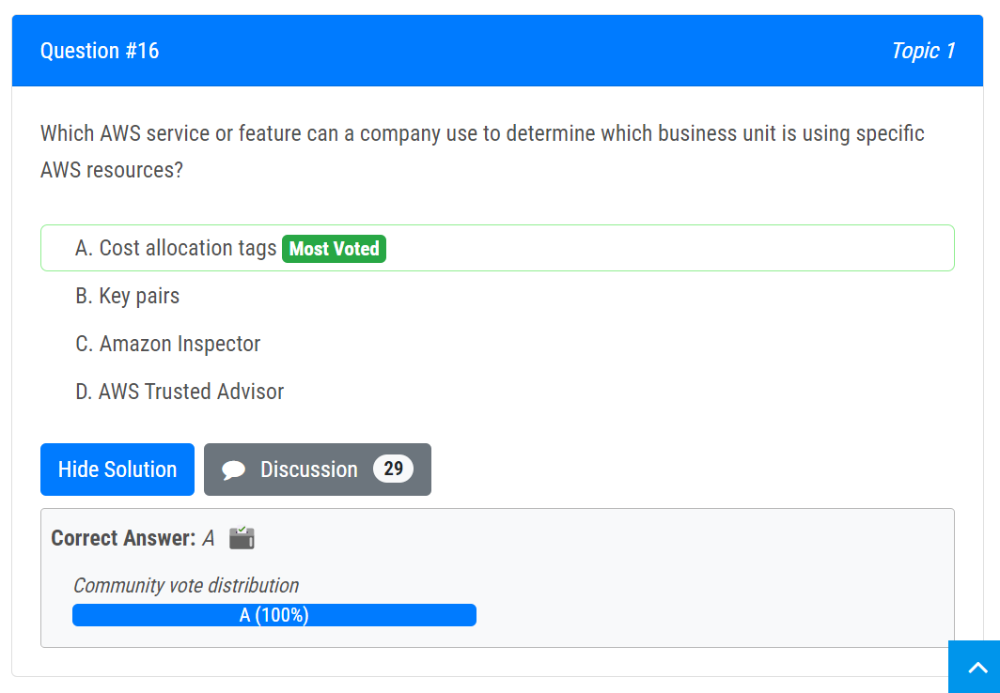

Question Set: https://www.examtopics.com/exams/amazon/aws-certified-cloud-practitioner/view/6/

++++

# More

##### Amazon Machine Images (AMIs)

An AMI is a pre-configured virtual machine image that contains the operating system, application software, and any other required components needed to launch an instance. AMIs can be used to create new instances in the same or a different region, which can be useful for disaster recovery purposes.

##### AWS Data Pipeline

a web service that helps you reliably process and **move data** between different AWS compute and storage services

##### AWS Service Catalog

allows organizations to create and manage **catalogs of IT services** that are approved for use on AWS.

manage **deployed IT services** and govern its infrastructure as code (IaC) templates

##### AWS  PrivateLink

provides direct secure connections **from VPCs to other AWS services.**

##### Amazon Macie

A **data security service** that **uses machine learning** (ML) and pattern matching to discover and help protect your sensitive data.

##### AWS IAM Access Analyzer

helps you identify the resources in your organization and accounts, such as Amazon S3 buckets or IAM roles, shared with an **external entity**. It automatically **reviews policies** and **provides actionable recommendations** for securing access to AWS resources.

To **identify unintended access** to your resources and data, which is a security risk.. 

##### AWS Transit Gateway

[AWS Transit Gateway]: https://aws.amazon.com/transit-gateway/

Connect VPCs and on-promises networks **through a central hub**. **centrally**

##### QuickSight

supports the creation of **visual reports** from AWS Cost and Usage Report data

##### AWS Infrastructure Event Management (IEM)

 offers architecture and scaling guidance and operational support during the preparation and execution of planned events

##### Amazon S3 Lifecycle rules

a set of rules that you can create to automate the transition of objects between different storage classes or deletion when objects are no longer needed. This can help you to save money on storage costs and to manage your data more effectively.

##### S3 Versioning

keeping multiple variants of an object in the same bucket, can be used to preserve, retrieve, and restore every version. 

##### AppStream 2.0

a fully managed application streaming service that **provides users instant access to their desktop applications** from anywhere. (e.g. A company wants to use the AWS Cloud to provide secure access to desktop applications that are running in a fully managed environment.)

##### AWS Global Accelerator

uses **edge locations** to improve the availability and performance of **applications** by routing traffic through the AWS global network infrastructure to the nearest edge location. This helps reduce latency and improve application responsiveness for users around the world. 

##### AWS Local Zones

Each AWS Local Zone location is **an extension of an AWS Region** where you can run your latency sensitive applications using AWS services 

##### Amazon Polly

a service that can be used to turn text into lifelike speech, uses advanced deep learning

##### VPC Flow Logs

a feature that enables you to capture information about the **IP traffic** going to and from network interfaces in your VPC

##### Site-to-Site VPN

[Site-to-Site VPN]: https://docs.aws.amazon.com/vpn/latest/s2svpn/VPC_VPN.html

the connection between your VPC and your own on-premises network

##### Disaster recovery options

##### AWS Artifact

Access AWS and ISV **security and compliance** **reports**. 

##### Amazon Comprehend

is a natural language processing (NLP) service offered by AWS. It provides pre-trained models to analyze text and extract insights, including sentiment analysis. (e.g. analyze on customer service email messgaes)

##### Gateway endpoints

Gateway VPC endpoints provide reliable connectivity to **Amazon S3 and DynamoDB** without requiring an internet gateway or a NAT device for your VPC. Gateway endpoints do not use AWS PrivateLink, unlike other types of VPC endpoints.

##### The Support Concierge Team 

are AWS billing and account experts that specialize in working with enterprise accounts.

##### AWS X-Ray

provides a complete view of **requests** as they travel through your application and filters visual data across payloads, functions, traces, services, APIs, and more with no-code and low-code motions.

view end-to-end performance metrics and troubleshoot distributed applications

##### AWS Systems Manager Session Manager 

is a fully managed service that provides secure and auditable remote shell access to EC2 instances directly through the AWS Management Console, CLI, or SDKs. With Session Manager, you can **access your instances without opening inbound SSH ports** or managing SSH keys.

##### Amazon Lightsail

**Build applications and websites fast** with low-cost, pre-configured cloud resources. (By Create a website or application in just a few clicks. Automatically configure networking, access, and security environments. (e.g. A company wants to migrate a <u>small</u> website and database quickly from on-premises infrastructure to the AWS Cloud. The company has <u>limited operational knowledge</u> to perform the migration.)

##### Amazon API Gateway

a **fully managed service** that makes it easy for developers to **create, publish, maintain, monitor, and secure APIs** at any scale. 

Using API Gateway, you can create RESTful APIs and WebSocket APIs that enable real-time two-way communication application. (e.g. publish and manage web services that provide REST APIs)

##### Amazon Rekognition

Automate and lower the cost of your image recognition and video analysis with **machine learning**

organize, characterize, and search large numbers of images

##### AWS Glue

AWS Glue is a **serverless data integration service**, is used specifically for extract, transform, and load (**ETL**) data

##### Amazon Athena

is a **serverless**, interactive **analytics service** built on open-source frameworks, supporting open-table and file formats.

##### Amazon ElastiCache

A service that provides the capability to create, manage, and scale a **distributed in-memory or cache** environment in the cloud 

 is an AWS **in-memory data store** service

**improve database performance** by reducing the amount of read I/O on the database. 

##### Amazon Augmented AI (Amazon A2I)

provides built-in human review workflows for common machine learning use cases, such as content moderation and text extraction from documents. With Amazon A2I, a person can also create their own workflows for machine learning models built on Amazon SageMaker or any other tools.

##### Amazon Textract 

a machine learning (ML) service that automatically extracts text, handwriting, and data from scanned documents. 

#### AWS Code___

##### AWS CodeStar

enables you to **quickly develop, build, and deploy applications** on AWS. 

set up an entire development and continuous delivery toolchain for coding, building, testing, and deploying code

##### AWS CodeCommit

a **managed source control system** that hosts Git repositories and works with all **Git-based tools**. 

##### AWS CodePipeline 

AWS CodePipeline is a **fully managed continuous delivery service** that continuous delivery (CI/CD) service that **automates the build, test, and deployment phases** of your release process

##### Amazon Codeguru

Amazon CodeGuru Profiler helps developers find an application’s **most expensive lines** of code

Amazon CodeGuru Security is a static application security testing (SAST) tool that combines machine learning (ML) and automated reasoning to **identify vulnerabilities in your code**, provide recommendations 

##### Amazon WorkSpaces

a fully managed desktop-as-a-service (DaaS) solution that allows users to **access their desktops** and applications securely from any supported device, including personal devices, such as laptops, tablets, or smartphones. 

provides a persistent, cloud-based desktop experience for end users, and it allows administrators to manage users, applications, and policies centrally.

##### AWS Batch

AWS Batch lets developers, scientists, and engineers efficiently **run hundreds of thousands of batch and ML computing jobs** while optimizing compute resources, so you can focus on analyzing results and solving problems. 

##### AWS Certificate Manager (ACM) 

provision, manage, and deploy public and private **SSL/TLS** to encrypt traffic for AWS services and your internal connected resources. ACM removes the time-consuming manual process of purchasing, uploading, and renewing SSL/TLS certificates.

##### Amazon Kinesis Data Analytics

Interactively **query and analyze data** in real time and continuously produce insights for time-sensitive use cases. 

##### AWS Abuse team

If a company discovers unauthorized access or abuse originating from a resource hosted on AWS, they should contact the AWS Abuse team. The Abuse team handles reports of inappropriate behavior, security incidents, and other potential violations of AWS Acceptable Use Policy (AUP). They will investigate the issue and take appropriate actions to address the situation.

##### AWS Config

continually assesses, **audits**, and evaluates the configurations and relationships of your resources on AWS, on premises, and on other clouds.

continuously monitors and records the changes to the configuration settings of your AWS resources

providing information about **changes to your AWS environment**

##### AWS Step Functions

build and coordinate applications using visual workflows. is a low-code, visual workflow service that developers can use to build distributed applications.

##### AWS Connect 

https://docs.aws.amazon.com/connect/latest/adminguide/what-is-amazon-connect.html

##### Security best practices in IAM

https://docs.aws.amazon.com/IAM/latest/UserGuide/best-practices.html

##### AWS Personal Health Dashboard 

AWS Personal Health Dashboard 

##### Amazon Connection

a cloud-based contact center service, you can set up a contact center in minutes that can scale to support millions of customers. can be used to provide an on-demand, cloud-based contact center

# Classified 

##### Containers

AWS Fargate; AWS ECS; AWS EKS

##### Machine Learning

AWS Cost Anomaly Detection; AWS Macie; Amazon Rekognition; AWS Batch

##### Serverless

- has built-in fault tolerance
- can scale based on demand
- Management of infrastructure is offloaded to AWS.

https://aws.amazon.com/serverless/

AWS Fargate (compute engine); S3; Athena (analyst service); Lambda

##### Compute service

https://docs.aws.amazon.com/whitepapers/latest/aws-overview/compute-services.html

Amazon Lightsail; AWS Batch; 

#####  Amazon FSx for Windows File Server 

Provide highly available, high performance storage to your Windows applications with full **SMB (Server Message Block) support**.

##### encryption

\##opt-in encryption## EBS Redshift RDS S3 Buckets EFS drives

##Automatic Encryption## Cloudtrail logs S3 Glecier Storage Gateways

# Difference

##### AWS Infrastructure Event Management (IEM) v.s. The designated AWS technical account manager (TAM)

##### CloudWatch v.s. CloudTrail

##### AWS Local Zones v.s. AWS Outposts

##### AWS Local Zones v.s. AWS Availability Zones

##### AWS Direct Connect v.s. AWS PrivateLink

##### IAM users v.s. IAM roles

##### IAM vs. AWS Organizations

##### Network ACL v.s. Security Group

##### SQS v.s. Pipeline

##### AWS X-Ray v.s. AWS CloudTrail

##### AWS Artifact v.s. AWS Compliance Program

##### GuardDuty v.s. Inspector v.s. Shield

##### Amazon WorkSpaces vs. Amazon AppStream 2.0

+++++

# ???

+++

# Compute in the Cloud

### **Amazon Elastic Compute Cloud (Amazon EC2)**

[EC2]: https://aws.amazon.com/ec2/

Secure and resizable compute capacity for virtually any workload

### Amazon EC2 Instance Types

- **General purpose instances**
  -  a balance of compute, memory, and networking resources
- **Compute optimized instances**
  -  for compute-bound applications that benefit from high-performance **processors**
  - e.g. web, application, and gaming servers
- **Memory optimized instances**
  - fast performance for workloads that process large datasets in memory
- **Accelerated computing instances**
  - use hardware accelerators, or coprocessors, to perform some functions more efficiently than is possible in software running on CPUs
- **Storage optimized instances**
  - for workloads that require high, sequential read and write access to large datasets on local storage
  - e.g. distributed file systems, data warehousing applications, and high-frequency online transaction processing (OLTP) systems

### EC2 Pricing

|                                  |                                                              |
| -------------------------------- | ------------------------------------------------------------ |
| On-Demand                        | - No upfront costs or minimum contracts apply. - For short-term, irregular workloads that cannot be interrupted. - **Less than 1 year** |
| **Reserved Instances**           | a billing discount applied to the use of On-Demand Instances. - a commitment of either **1 year or 3 years** |
| - Standard Reserved Instances    | - If knowing the choice of instance type & size & AWS Region |
| - Convertible Reserved Instances | - If runs in different Zones / instance types                |
| EC2 Instance Saving Plans        | - when you make an **hourly spend commitment** to an instance family and Region for a **1-year or 3-year term**. -  if you need flexibility in your Amazon EC2 usage over the duration of the commitment term - save of up to 72% over On-Demand costs |
| Spot Instance                    | - ideal for workloads with **flexible start and end times**, or can **withstand interruptions**. - processing job that can start and stop as needed without affecting overall operations |
| Dedicated Hosts                  | -  physical servers with Amazon EC2 instance capacity that is fully dedicated to your use. - for who owns per-core **software / SQL licenses** |

##### !!

**Standard Reserved Instances typically provide the highest discount levels**. One-year Standard Reserved Instances provide a similar discount to three-year Convertible Reserved Instances.

##### Dedicated __

A Dedicated Host gives you additional visibility and control over how instances are placed on a physical server, and you can consistently deploy your instances to the same physical server over time.

With dedicated hosts, you can use your existing Microsoft SQL Server licenses on Amazon EC2 instances. This allows you to bring your existing licenses and use them on EC2 instances, rather than purchasing new licenses

### Scalability

beginning with only the resources you need and designing your architecture to automatically respond to changing demand by scaling out or in

#### Amazon EC2 Auto Scaling

automatically add or remove Amazon EC2 instances, scale **the number of EC2 instances** in or out automatically, based on demand.

- Approaches: dynamic scaling, predictive scaling

- benefits: 
  -  Improved health and availability of applications
  - Optimized performance and costs

### Elastic Load Balancing

##### Application Load Balancers

are used to route HTTP/HTTPS traffic.

##### Network Load Balancer

TCP, UDP, TLS

### Messaging and Queuing

#### **monolithic application**

made of multiple components which communicate with each other.  If a single component fails, other components fail. 

#### Microservices approacd

application components are loosely coupled, prevents the entire application from failing. 

if a single component fails, the other components continue to work. 

#### **Amazon Simple Notification Service (Amazon SNS)**

can **integrate and decouple** distributed applications; **distribute** application-to-person **notifications** to your customers with SMS / email / push notifications

 a publish/subscribe service, subscribers can be web servers, email addresses, AWS Lambda functions, or several other optionscloud

#### **Amazon Simple Queue Service (Amazon SQS)**

a message queuing service, Fully managed message queuing for microservices, **distributed systems**, and serverless applications. makes it easy to **decouple and scale** microservices, distributed systems, and serverless applications.

send, store, and receive messages between software components **at any volume**

helps developers use **loose coupling** and reliable messaging **between microservices**

##### SQS v.s. Pipeline

**SQS**:  between software components **at any volume**

**Pipeline**: reliably process and move data between different AWS compute and storage services

### Additional Compute Services

#### **Serverless computing**

do not need to provision or manage these servers

##### **AWS Lambda**

is a **serverless** **computing** service. 

Automatically respond to code execution requests at any scale.  Run code without provisioning or managing infrastructure

(So: maximizes operational efficiency and minimizes the cost of running the application)

- businesses pay only for the compute time that they consume. They are charged only when their application code is running.
- can be configured to run up to 15 minutes per execution. You can set the timeout to any value between 1 second and 15 minutes.

#### **Containers**

a standard way to package your application's code and dependencies into a single object

#### **Amazon Elastic Container Service (Amazon ECS)**

a highly scalable, high-performance **container management system** that enables you to **run and scale** containerized applications on AWS

supports Docker containers

#### **Amazon Elastic Kubernetes Service (Amazon EKS)**

a fully managed service that you can use to run Kubernetes on AWS

enables you to deploy and manage containerized applications at scale

#### **AWS Fargate**

a **serverless compute engine** for **containers**

allows you to run containers without having to manage the underlying EC2 instances

**automatically provisions** and manages the resources required to run the containers

**only** provision the **necessary** resources

# Global Infrastructure and Reliability

### Global Infrastructure

#### Region

Each Region is a separate geographic area, thay are isolated from each other. Is a component of AWS Global Infrastructure. 

A physical location around the world where data centers are clustered

##### Select a region

- Compliance with data governance and legal requirements
- Proximity to your customers
- Available services within a region
- Pricing

#### Availability Zone

**A fully isolated portion of the AWS global infrastructure**. / is multiple, isolated locations within each Region. / is a single data center or a group of data centers **within a Region**

Availability Zones **consist of one or more discrete data centers** that have redundant power, networking, and connectivity (FOR: separate data centers **with minimal communication latency**) / consists of one or more isolated data centers in the same regional area that are interconnected through **low-latency networks**?

##### Region v.s. Zone

A Region consists of three or more Availability Zones.

#### VPC | Zone | Region 

- a VPC belongs to a Region, a Region can have multiple VPCs 
- a VPC can spans all availability zones within an AWS Region

#### Amazon CloudFront

A **content delivery network (CDN) service** built for high performance, security, and developer convenience. **Uses edge locations**. 

Securely **deliver** content with low latency and high transfer speeds

### Edge Locations

is a site that Amazon CloudFront uses to store cached copies of your content closer to your customers for faster delivery.

is used to distribute content to users around the world

##### Who use edge location?

- Amazon CloudFront
- AWS Global Accelerator
- Route 53

### Provision AWS services

##### **AWS Management Console**

a web-based interface for accessing and managing AWS services

##### **AWS Command Line Interface (AWS CLI)**

control multiple AWS services directly from the command line within one tool, provides **automation actions** for AWS services and applications **through scripts**

user can **change IAM user password** through CLI and AWS Management Console

##### Software Development Kits (SDKs)

make it easier for you to use AWS services through an API designed for your programming language or platform, enable you to use AWS services with your existing applications or create entirely new applications that will run on AWS.

#### **AWS Elastic Beanstalk**

Deploying the resources according to the configuration settings provided by users

a fully managed service that **makes it easy to deploy, run, and scale applications** in multiple languages such as Java, .NET, PHP, Node.js, Python, Ruby, and Go. You can simply upload your application code, and the service will automatically handle other things. 

to perform: 

- Adjust capacity
- Load balancing
- Automatic scaling
- Application health monitoring

#### **AWS CloudFormation**

Treat your **infrastructure as code**. 

To build an environment by writing lines of code instead of using the AWS Management Console to individually provision resources.

It provisions your resources in a safe, repeatable manner, enabling you to frequently build your infrastructure and applications

allows you to create and **manage a collection of related AWS resources** **using templates**, to reliably provision, manage, and update its infrastructure in the AWS Cloud

#### AWS Outposts

[Outpost]: https://docs.aws.amazon.com/AWSEC2/latest/UserGuide/using-regions-availability-zones.html#concepts-outposts

A fully managed service that **extends** AWS infrastructure, services, APIs, and tools to customer premises. By providing local access to AWS managed infrastructure.

supports workloads and devices requiring **low latency access** **to on-premises systems**, local data processing, data residency, and application migration with local system interdependencies. 

##### VPC & Outposts

You can **extend any VPC in the Region to your Outpost** by adding an Outpost subnet.

**Each Outpost can support multiple VPCs** that can have one or more Outpost subnets

# Networking

### **Amazon Virtual Private Cloud (Amazon VPC)**

A **networking service** for establishing boundaries around your AWS resources

enables you to **provision an isolated section** (maybe for **security purposes**) of the AWS Cloud, where resources can be launched in a virtual network you defined, or organize resources into subnets

#### Internet gateway

being attached to the VPC, is a connection **between a VPC and the internet**. 

#### Virtual private gateway

establish a **virtual private network (VPN) connection** **between your VPC and a private network**,

#### AWS Direct Connect

a service that establish a **dedicated private** connection **between your on-premise data center and a VPC**.  / between **on premise and AWS** (e.g. between on-premises servers and Amazon EFS)

##### AWS Direct Connect v.s. AWS PrivateLink

- Direct connect is for private dedicated connection **between on premise and AWS**, <u>***not** between **workloads** (applications and services)*</u>

- PrivateLink provides direct secure connections **from VPCs to other AWS services**.

##### Workloads

an application, service, capability, or a specified amount of work that consumes cloud-based resources

##### Customer gateway

is the customer side of a VPN connection, is one of the **components of an AWS Site-to-Site VPN connection**

##### VPC Peering

A VPC peering connection is a networking connection **between two VPCs** that enables you to route traffic between them

### Subnets

is **a section of VPC** that can contain resources that being grouped 

#### Network Access Control list (ACL)

a **virtual firewall** that controls inbound and outbound traffic **at the subnet level**.

is a **Stateless packet filtering**, which remember nothing 

They process rules in order, starting with the lowest numbered rule, when deciding whether to allow traffic.

#### Security Group

a **virtual firewall** that controls inbound and outbound traffic **for an Amazon EC2 instance**.

By default, a security group **denies all** inbound traffic and allows all outbound traffic.  

is a **Stateful packet filtering**, remember previous decisions made for incoming packets

##### ACL v.s. Security Group

Both are virtual firewall

ACL: subnet level; stateless

SG: instance level; stateful

### Global Network

#### Domain Name System (DNS)

Translating a domain name to an IP address

#### **Amazon Route 53**

is **a highly available and scalable DNS web service**, route end users to internet applications hosted in AWS, can route users to infrastructure outside of AWS.

provides domain registration, DNS routing, and service health checks

# Storage and Databases

### Amazon Elastic Block Store (Amazon EBS)

a service that provides **block-level** storage volumes that you can **use with Amazon EC2 instances**.

it can attach to an Amazon EC2 instance. 

Stores data **in a single Availability Zone**. 

Best for **data that requires retention**: by creating Amazon EBS snapshots, **retention** can be realized. 

To attach an Amazon EC2 instance to an EBS volume, both the Amazon EC2 instance and the EBS volume must reside within the same Availability Zone.

#### **Amazon EBS snapshots**

an incremental backup (the first backup taken of a volume copies all the data. For subsequent backups, only the blocks of data that have changed since the most recent snapshot are saved. )

### Instance stores

**Block-level** storage **volumes** behave like physical hard drives.

disk storage that is **physically attached to the host computer** for an EC2 instance, provides **temporary block-level storage** for an Amazon EC2 instance. 

Data is deleted when an EC2 instance is stopped

### Amazon Simple Storage Service (Amazon S3)

is a service that provides **object-level** storage. Amazon S3 stores data as objects in buckets.

offers virtually **unlimited storage**.

can be used to **host static websites** to deliver HTML, JavaScript, images, and video for sites that do not contain server-side scripting.

#### Tag the objects in the S3 bucket

- Object tags enable **fine-grained access control of permissions**. 
  - (e.g. A user is storing objects in Amazon S3. The user needs to <u>restrict access to the objects</u> to meet compliance obligations.)
- Use object tagging to categorize storage
- Using cost allocation S3 bucket tags to track the storage cost or other criteria for individual projects or groups of projects

#### Object storage

In **object storage**, each object consists of data, metadata, and a key.

#### Amazon S3 classes

- **S3 Standard**
  - frequently accessed data
  - Stores data in **a minimum of three** Availability Zones
  - cost **higher** than other storage classes intended for infrequently accessed data and archival storage.
- **S3 Standard-Infrequent Access**
  - for infrequently accessed data but requires **high availability** when needed
  - store data in **a minimum of three** Availability Zones
  - has a lower storage price and higher retrieval price
- **S3 One Zone-Infrequent Access**
  - Stores data in a single Availability Zone
  - intended for use cases with infrequently accessed data that is **re-creatable**
- **S3 Intelligent-Tiering**
  - Ideal for data with unknown or changing access patterns
  - Requires a small monthly monitoring and automation fee per object
  - Amazon S3 **monitors objects’ access patterns**
    - IF no access for 30 days, be automated moved to S3-Standard IA
    - IF access, moved to S3 Standard
- **S3 Glacier Instant Retrieval**
  - Works well for archived data that requires **immediate access** (within a few milliseconds, the same performance as S3 Standard)
- **S3 Glacier Flexible Retrieval**
  - **Low-cost storage** designed for data archiving
  - retrieve objects **from 1 minute to 12 hours**
- **S3 Glacier Deep Archive**
  - **Lowest-cost storage** class ideal for archiving
  - retrieve objects within **12 hours**, data retrieval from **12 to 48 hours**
  - stored across at least three geographically dispersed Availability Zones
- **S3 Outposts**
  - Creates **S3 buckets** on Amazon S3 Outposts
  - Makes it easier to retrieve, store, and access data **on AWS Outposts**
    - delivers object storage **to your on-premises** AWS Outposts environment
    - store data durably and redundantly across multiple devices and servers on your Outposts
    - works well for workloads with local data residency requirements that must satisfy demanding performance needs by keeping data close to on-premises applications.

**Availability: S3 Standard = S3 Standard-IA = S3 Glacier Instant Retrieval**

**storage price: S3 Glacier Deep Archive < S3 Glacier Flexible Retrieval < S3 One Zone-IA < S3 Standard**

##### Move between tiers

In the S3 Intelligent-Tiering storage class, Amazon S3 moves objects between a frequent access tier and an infrequent access tier. 

If an object has not accessed an object for 30 consecutive days, Amazon S3 automatically moves it to the infrequent access tier, S3 Standard-IA. If an object is accessed in the infrequent access tier, Amazon S3 automatically moves it to the frequent access tier, S3 Standard.

#### AWS Storage Gateway

AWS Storage Gateway is a set of hybrid cloud storage services that **provide on-premises access to virtually unlimited cloud storage** 

### Amazon Elastic File System (Amazon EFS)

a scalable file system used with AWS Cloud services and on-premises resources. 

a **regional service**. It stores data in and **across multiple Availability Zones**. 

- on-premises servers can access Amazon EFS using AWS Direct Connect.
- allows for file sharing between multiple Amazon EC2 instances

### Amazon Relational Database Service (Amazon RDS)

a service that enables you to run **relational databases** in the AWS Cloud.

is a **managed** service that **automates** tasks such as hardware **provisioning, database setup, patching, and backups**.

- can integrate Amazon RDS with AWS Lambda to query your database from a serverless application.

provides a number of different security options

available on six database engines, supported database engines include: 

- #### Amazon Aurora 

  - an **enterprise-class relational** database, up to five times faster than standard MySQL databases
  - provides built-in **security**, continuous **backups**, **serverless** compute, up to 15 read replicas, automated multi-Region **replication**, and integrations with other AWS services.

- PostgreSQL

- MySQL

- MariaDB

- **Oracle** Database: Amazon RDS for Oracle is a fully managed commercial database that makes it easy to set up, operate, and scale Oracle deployments in the cloud. 

- Microsoft SQL Server

#### **Amazon DynamoDB**

a key-value database **service** (**Nonrelational databases**, can add or remove attributes from items in the table at any time)

- is **serverless** (do not have to provision, patch, or manage servers; also do not have to install, maintain, or operate software)
- has automatic scaling (a suitable choice for use cases that **require high performance while scaling**)

##### Amazon DynamoDB global tables 

provide a fully managed, multi-region, and multi-master database replication solution. With global tables, the company can replicate data across multiple AWS Regions, allowing the data to be accessed from the AWS Region closest to the user.

#### Amazon Redshift

 **a data warehousing service **that you can use for big data analytics, offers the ability to collect data from many sources and helps you to understand relationships and trends across your data.

uses SQL to **analyze structured and semi-structured data** across data warehouses, operational databases, and data lakes, using AWS-designed hardware and machine learning to deliver the best price performance at any scale.

### **AWS Database Migration Service (AWS DMS)**

move data between a source database and a target database. The source and target databases can be of the same type or different types

- Development and test database migrations
- Database consolidation
- Continuous replication: sending ongoing copies of data

### Difference

|      | storage      | Zone                                              |      |
| ---- | ------------ | ------------------------------------------------- | ---- |
| EBS  | Block-level  | Single Zone                                       |      |
| S3   | Object-level | -> depend on class, use multiple zones by default |      |
| EFS  | Block-level  | Multiple Zones                                    |      |
| EC2  |              | -> depend on class, use single zones by default   |      |

- Object storage is best used for large amounts of **unstructured data**. 

### **Additional database services**

##### Amazon DocumentDB 

store in a cluster volume, across 3 availability zones

##### Amazon NepTune

- store in a cluster volume, across 3 availability zones
- High performance graph analytics and serverless database for superior scalability and availability

##### Amazon Quantum Ledger Database (Amazon QLDB)

##### Amazon Management Blockchain

##### Amazon ElasticCache

##### Amazon DynamoDB Accelerator

# Security

### AWS Shared Responsibility Model

**Customers** are responsible for the security of everything that they create and put *in* the AWS Cloud.

**AWS** is responsible for security *of* the cloud. AWS operates, manages, and controls the components at all layers of infrastructure. 

##### Shared controls: 

- **Patch Management** - in the infrastructure; in guest OS and applications (including EC2 instances)
- **Configuration Management** - infrastructure devices; guest OS, database, applications
- **Awareness & Training** - each one's employee

##### !!!

It's **customers**' responsibility to 

- patch EC2 instances
- to updating the **guest OS** on EC2 instances
- Apply encryption options for the database (when using Amazon RDS
- managing their **data**
- using IAM tools

**AWS** responsibility: 

- Installing the database engine when a workload is running in Amazon RDS; 
- Installing OS on EC2 instanc

### AWS IAM

**AWS Identity and Access Management (IAM)**

- enables you to **manage access** to AWS **services and resources** securely
- You can apply IAM policies to IAM users, groups, or roles. You cannot apply an IAM policy to the AWS account root user.
- IAM supports multi-factor authentication (MFA)

Always **no charge**. 

#### IAM credential report

provides details about the IAM users in an AWS account, including their **access keys, passwords, MFA devices**, and various other security-related information. 

However, the report does ***not*** include information such as the type of MFA device assigned to an IAM user, the User-Agent browser identifier for each logged-in IAM user, or the number of incorrect login attempts.

#### **AWS account root user**

has complete access to all the AWS services and resources in the account

- Follow the security principle of **least privilege** when granting permissions: prevent users or roles from having more permissions than needed to perform their tasks.
- Only the AWS account root user has the permissions to 
  - change AWS Support plan
  - close an AWS account
- Only AWS account owner can 
  - create and manage **access keys** for the AWS account. 

##### Access key

not use the root user access keys for everyday access to AWS services and to instead create IAM users with only the necessary permissions.  Avoid sharing the root user access keys. The best practice is to delete the keys and create IAM users with appropriate permissions.

#### **IAM users**

consists of a name and credentials

##### IAM user Password changing 

If users have been granted permission to change their own IAM user password, you can **use AWS CLI / AWS API / AWS Management Console.** 

#### **IAM policies**

a document that allows or denies permissions to AWS services and resources

#### **IAM groups**

a **collection of IAM users**, all users in the group are granted permissions specified by the policy.

#### **IAM roles**

An IAM role is an identity that you can assume to gain **temporary access** to permissions.  

AWS security best practices recommend **using IAM roles to grant permissions to AWS resources**, including S3 buckets. 

By **attaching IAM roles to EC2 instance**, make it get access to the required AWS resources. 

#### **Multi-factor authentication**

provides an extra layer of security for your AWS account

##### IAM users v.s. IAM roles

Users -give ability to people: creates AWS access credentials for individuals; add users to IAM groups

Roles - grant access to resources/service/account:  an application that runs on Amazon EC2 instances requires access to other AWS services; the company creates an application that runs on a mobile phone that makes requests to AWS

##### IAM cannot

1. cannot limit the access to AWS service for member accounts, SCPs can
2. cannot see if the security group was changed, AWS CloudTrail can

### **AWS Organizations**

**consolidate and manage** multiple AWS **accounts** within a central location, centrally **control permissions** for the accounts in your organization by using **SCPs (service control policies)**

- centrally manage and govern its AWS Cloud environment
- automate the creation of AWS accounts
- simplify billing processes, consolidated billing capabilities

#### SCPs (Service Control Policies)

Can be applied to control policies **to the organization root**, an individual member account, or an OU. 

Can **restrict the use of specific AWS services** or to impose additional conditions or requirements on the use of those services. / enable you to **place restrictions on the AWS services**

#### **Organizational units**

group accounts into organizational units (OUs) to make it easier to manage accounts with similar business or security requirements

### Amazon Cognito

Implement secure, frictionless customer **identity and access management** that scales

helps you implement customer **identity and access management (CIAM)** into your **web and mobile applications**. You can quickly **set up / add user authentication** and **access control** to your applications in minutes.

**lets you add user sign-up, sign-in, and access control to your web and mobile apps quickly and easily.**

### Compliance

#### **AWS Artifact**

is a service that provides on-demand access to **AWS security and compliance reports** and select online agreements

- consists of two main sections: AWS Artifact Agreements and AWS Artifact Reports
- provide document: AWS ISO certifications, include the System and Organization Control (SOC) reports.

#### **Customer Compliance Center**

 read customer compliance stories

#### AWS Compliance Program

**helps customers to understand** the robust controls in place at AWS to maintain security and compliance of the cloud

##### AWS Artifact v.s. AWS Compliance Program

AWS Artifact: manage and accept all required agreements

AWS Compliance Program: help you to decide

### Denial-of-Service Attacks

is a deliberate attempt to make a website or application unavailable to users.

#### **AWS Shield**

a service that automatically detect and mitigate **sophisticated** **network-level** **distributed** **DDoS** events

- provides two levels of protection: Standard and Advanced
  - automatically protects all AWS customers at no cost. It protects your AWS resources from the most common, frequently occurring types of DDoS attacks. 
  - a paid service that provides detailed attack diagnostics and the ability to detect and mitigate sophisticated DDoS attacks. 

### Additional Security Services

#### **AWS Key Management Service (AWS KMS)**

enables you to perform **encryption** operations through the use of **cryptographic keys**

#### **AWS WAF**

**Web Application Firewall** that lets you **monitor network requests** that come into your **web applications**. 

works in a similar way to block or allow traffic. However, it does this **by using a web access control list (ACL)**

You can also use AWS WAF to block or allow requests based on conditions that you specify, such as the IP addresses that requests originate from or **values in the requests**. 

- FOR: 
  - **sql injection** attacks
  - cross-site scripting
- can be used by the services: 
  - Amazon CouldFront
  - Application Load Balancer
  - Amazon API Gateway
  - AWS AppSync

#### **Amazon Inspector**

helps to improve the security and compliance of applications by **running automated security assessments**, give reports

It checks applications for **security vulnerabilities** and deviations from security best practices

#### **Amazon GuardDuty**

a service that provides **intelligent threat detection** for your AWS infrastructure and resources. 

It identifies threats by continuously **monitoring** the network activity and account behavior within your AWS environment.

# Monitoring and Analytics

### Amazon CloudWatch

Observe and monitor resources and applications on AWS, on premises, and on other clouds.

Includes performance changes, **resource use**, operational health. 

enables you to monitor and manage various **metrics** and **configure alarm** actions based on data from those metrics

#### metrics

represent the data points for your resources. 

AWS services send metrics to CloudWatch -> CloudWatch uses these metrics to **create graphs automatically** that show how performance has changed over time.

#### **CloudWatch alarms**

automatically perform actions if the value of your metric has gone above or below a predefined threshold

#### **CloudWatch dashboard**

access all the metrics for your resources from a single location

#### Amazon CloudWatch Logs Insights

interactively search and analyze your log data in Amazon CloudWatch Logs. You can perform queries to help you more efficiently and effectively respond to operational issues.

#### CloudWatch Logs Stream

Real-time process, monitor, alert & notification.

### AWS CloudTrail

**Track user activity** and **API usage**, records **API calls** for your account, includes the identity of the API caller, the time of the API call, the source IP address of the API caller, and more, like a log of actions. 

can determine whether a change was made to the security groups of an EC2 instance in the last month

providing information about **changes to your AWS environment**

##### CloudTrail logs

provide a record of all the AWS Management Console sign-in events and API calls made in the AWS account.

#### CloudTrail Insights

automatically detect unusual API activities in your AWS account.

### AWS Trusted Advisor

a web service that **inspects** your AWS environment and **provides real-time recommendations** in accordance with AWS best practices

can have alerts

in five categories: **cost optimization, performance, security (like Amazon S3 buckets), fault tolerance, and service limits**

For each category: Green check - no problems; Orange triangle - investigations; Red circle - recommended actions. 

##### CloudWatch v.s. AWS Trusted Advisor

AWS Trusted Advisor can be used to **proactively** monitor and plan for the service quotas of AWS resources

# Pricing and Support

### AWS Free Tier

A program allow customers to use AWS services without costs. using certain services without having to worry about incurring costs for the specified period

- Always Free: like AWS Lambda requests, Amazon DynamoDB stroage
- 12 Months Free: offered to new AWS customers
- Trials: from the date you activate a particular service, like Amazon Inspector

#### **How AWS pricing works**

#### AWS Pricing Calculator

explore AWS services and **create an estimate** for the cost of your use cases on AWS, **forecast** the cost of new 

### Billing Dashboard

to pay your AWS bill, monitor your usage, and analyze and control your costs.

### Consolidated Billing

is a feature of AWS Organizations

enables you to receive **a single bill for all AWS accounts** in your organization, with reviewing itemized charges incurred **by each account**. 

aggregates usage across accounts so that the company can reach volume discount thresholds sooner. 

share bulk discount pricing, Savings Plans, and Reserved Instances across the accounts in your organization

### AWS Budgets  

create budgets **to plan** your service usage, service costs, and instance reservations. 

set up a **custom spending threshold** and set custom **alerts** when your usage exceeds (or is forecasted to exceed) the budgeted amount.

### **AWS Cost Explorer**

is a tool that lets you **visualize**, understanlid, and manage your AWS costs and usage over time.

includes a default report of the costs and usage for your top five cost-accruing AWS services

**forecast future costs** and usage based on past consumption. 

#### AWS Cost and Usage Reports

contains the most comprehensive set of cost and usage data available. You can use Cost and Usage Reports to publish your AWS billing reports. These reports **can be customized to break down costs** by various dimensions such as **product, tags, and time intervals** (hour, day, month, etc.).

The report can be **placed in an Amazon S3 bucket**

#### AWS cost allocation tags

You can use tags to organize your resources, and cost allocation tags to **track your AWS costs on a detailed level**. (e.g. wants to monitor the AWS Cloud costs incurred by each application.)

#### AWS Cost Anomaly Detection

an AWS cost management feature that **uses machine learning** to **continually monitor** your cost and usage **to detect unusual spends**.

### **AWS Support**

https://aws.amazon.com/premiumsupport/plans/

**Basic Support**: free for all, includes access to whitepapers, documentation, and support communities

The followings include all the benefits of Basic Support: 

|                       |                                                              |
| --------------------- | ------------------------------------------------------------ |
| **Developer Support** | Best practice guidance; Client-side diagnostic tools; Building-block **architecture** support (guidance for how to use AWS offerings, features, and services together) |
| **Business Support**  | Use-case guidance to identify AWS offerings, features, and services; All **AWS Trusted Advisor checks**; Limited support for third-party software, such as common operating systems and application stack components; **Programmatic Case Management** |

**AWS Enterprise On-Ramp Support**: includes all features above, and:

- A pool of **TAM** to provide proactive guidance and coordinate access to programs and AWS experts
- A Cost Optimization workshop (one per year)
- A **Concierge support team** for billing and account assistance
- Tools to monitor costs and performance through Trusted Advisor and Health API/Dashboard
- Less than **30 minute response times for business-critical issues**, and access to escalation-engineers for accelerated resolution.

**Enterprise Support**: includes all features above, and:

- A **designated** **TAM** to provide proactive guidance and coordinate access
- Operations Reviews and tools to monitor health
- Training and Game Days to drive innovation
- Tools to monitor costs and performance through Trusted Advisor and Health API/Dashboard

also provides full access to proactive services

#### **Technical Account Manager (TAM)**

primary point of contact at AWS. TAM educates, empowers, and evolves your cloud journey across the full range of AWS **services**. 

### Marketplace

a digital catalog that includes thousands of software listings from independent software vendors, allows you to find, test, and buy software that runs on AWS. 

has several categories, such as Infrastructure Software, DevOps, Data Products, Professional Services, Business Applications, Machine Learning, Industries, and Internet of Things (IoT).

A

# Migration and Innovation

### AWS CAF

#### **Six core perspectives of the Cloud Adoption Framework** - **Perspectives**

- business capabilities: 

  - **Business**: helps moves a business from a model that separates business and IT strategies into a business model that integrates IT strategy.
  - **People**: helps Human Resources (HR) employees prepare their teams for cloud adoption by updating organizational processes and staff skills to include cloud-based competencies.

  - **Governance**: provides the capability to update the staff skills and organizational processes that are necessary to ensure business governance in the cloud.

- technical capabilities: 

  - **Platform**
  - **Security**
  - **Operations**: principles for operating in the cloud by using **agile** best practices.

### Migration Strategies

- **Rehosting** - “lift-and-shift”, moving applications without changes
- **Replatforming** - “lift, tinker, and shift,”, making a few cloud optimizations to realize a tangible benefit, without changing the core architecture
- **Refactoring/re-architecting** - reimagining how an application is architected and developed by using cloud-native featurez
- **Repurchasing** - moving from a traditional license to a software-as-a-service model
- **Retaining** -  keeping applications that are critical for the business in the source environment
- **Retiring** - removing applications that are no longer needed.

### AWS Snow Family

a collection of **physical devices** that help to **physically transport** up to exabytes of data into and out of AWS

Composed of:

- **AWS Snowcone** - 14TB, small, rugged, and secure edge computing and data transfer device
- **AWS Snowball** - 80TB
  - **Snowball Edge Storage Optimized** - large-scale data migrations and recurring transfer workflows
  - **Snowball Edge Compute Optimized** - provides powerful computing resources 
- **AWS Snowmobile**. - 100 petabytes, an exabyte-scale data transfer service used to move large amounts of data to AWS

### Innovation

- **Serverless applications**
  - AWS Lambda
- **Artificial intelligence**
- **Machine learning**
  - Amazon SageMaker - 

#### **Amazon Lex**

can quickly build, test, and deploy conversational chatbots to use in your applications.

# The Cloud Journey

### **The AWS Well-Architected Framework**

helps you understand how to design and operate reliable, secure, efficient, and cost-effective systems in the AWS Cloud, provides a way for you to consistently measure your architecture

- **Operational excellence**: he ability to **support development and run** workloads effectively

  - ##### Operational Excellence five **design principles**

    - Perform operations as code
    - Make frequent, small, reversible changes
    - Refine operations procedures frequently
    - Anticipate failure
    - Learn from all operational failures

- **Security**: 
- **Reliability**: the ability of a workload to **perform its intended function** **correctly and consistently** when it’s expected to

  - Automatically recover from failure
  - Test recovery procedures
  - Scale horizontally to increase aggregate workload availability
  - Stop guessing capacity
  - Manage change through automation

- **Performance efficiency**: use **computing resources** efficiently, using computing resources in ways that meet system requirements
- **Cost optimization**: adopting a consumption model, analyzing and attributing expenditure, and using managed services
- **Sustainability**: by reducing energy consumption and increasing efficiency

### **Advantages of cloud computing**

- **Trade upfront expense for variable expense**
  - pay only when you consume computing resources.

- **Benefit from massive economies of scale**
  - achieve a lower variable cost than you can get on your own
  - AWS demonstrate with its ability to **offer lower variable costs as a result of high purchase volumes**

- **Stop guessing capacity**.
- **Increase speed and agility.**
- **Stop spending money running and maintaining data centers.**
- **Go global in minutes.**

#### Design principles

https://docs.aws.amazon.com/wellarchitected/latest/framework/oe-design-principles.html

