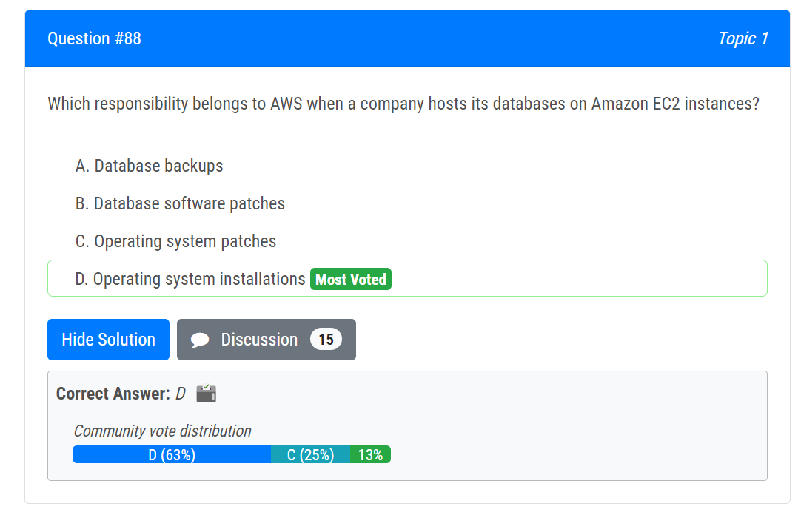

Question Set: https://www.examtopics.com/exams/amazon/aws-certified-cloud-practitioner/view/6/

### AWS Code___

##### AWS CodeStar

enables you to **quickly develop, build, and deploy applications** on AWS. 

set up an entire development and continuous delivery toolchain for coding, building, testing, and deploying code

##### AWS CodeDeploy 

a service that automates **code deployments to any instance**, including Amazon EC2 instances and instances running on-premises

##### AWS CodeCommit

**host, store and manage** developers' source code in AWS.

a **managed source control system** that hosts Git repositories and works with all **Git-based tools**. 

##### AWS CodePipeline 

AWS CodePipeline is a **fully managed continuous delivery service** that continuous delivery (CI/CD) service that **automates the build, test, and deployment phases** of your release process

- **continually deploy** updated code through a series of **automated steps** (build, test, package, and deploy)

##### Amazon Codeguru

Amazon CodeGuru Profiler helps developers find an application’s **most expensive lines** of code

Amazon CodeGuru Security is a static application security testing (SAST) tool that combines machine learning (ML) and automated reasoning to **identify vulnerabilities in your code**, provide recommendations 

##### AWS CodeBuild

**Build and test** code with automatic scaling

### ML/AI

##### Amazon Comprehend

is a natural language processing (**NLP**) service offered by AWS. It provides pre-trained models to **analyze text and extract insights**, including sentiment analysis. (e.g. analyze on customer service email messgaes)

##### Amazon Polly

a service that can be used to **turn text into lifelike speech**, uses advanced deep learning

##### Amazon Rekognition

Automate and lower the cost of your **image recognition and video analysis** with **machine learning**

- organize, characterize, and search large numbers of images

##### Amazon Personalize

provide product **recommendations** based on its customer data.

##### Amazon Lex 

is a service that builds **conversational interfaces** using voice and text.

##### Amazon Augmented AI (Amazon A2I)

provides **built-in human review workflows** for common machine learning use cases, such as content moderation and text extraction from documents. With Amazon A2I, a person can also create their own workflows for machine learning models built on Amazon SageMaker or any other tools.

##### Amazon Textract 

a machine learning (ML) service that automatically extracts text, handwriting, and data **from scanned documents**. 

##### Amazon SageMaker

 a managed Machine Learning service. With Amazon SageMaker, you can **package your own algorithms** that can then be trained and deployed in the SageMaker environment.

### management services

##### AWS Service Catalog

Create, share, organize, and govern your curated **IaC** templates and **manage deployed IT services** 

allows organizations to create and manage **catalogs of IT services** that are approved for use on AWS.

- to limit its employees' AWS access to a portfolio of predefined AWS resources
- manage **deployed IT services** and govern its infrastructure as code (IaC) templates

##### AWS Application Discovery Service

 helps you plan your **migration** to the AWS cloud by collecting usage and configuration data about your on-premises servers.

##### AWS Resource Access Manager (AWS RAM)

designed to enable you to securely **share your AWS resources** with any AWS account or, if you are part of AWS Organizations, with Organizational Units (OUs) or within your organization, **reducing overheads and centralizing access management** to shared resources.

##### **AWS Management Console**

##### AWS Certificate Manager (ACM) 

provision, manage, and deploy public and private **SSL/TLS** to **encrypt traffic** for AWS services and your internal connected resources. ACM removes the time-consuming manual process of purchasing, uploading, and renewing SSL/TLS certificates.

##### 

### Configuration

##### AWS OpsWorks

a configuration management service that provides managed instances of Chef and Puppet. Chef and Puppet are **automation** platforms

##### AWS Config

continually assesses, **audits**, and evaluates the configurations and relationships of your resources on AWS, on premises, and on other clouds.

continuously monitors and records the changes to the configuration settings of your AWS resources, manage configuration versions

providing information about **changes to your AWS environment**

##### AWS Launch Wizard 

offers a guided way of sizing, configuring, and deploying AWS resources for third-party applications, such as SQL Server Always On and SAP, without needing to manually identify and provision individual AWS resources.

# More

##### AWS Data Pipeline

a web service that helps you reliably process and **move data** between different AWS compute and storage services

##### AWS Infrastructure Event Management (IEM)

 offers architecture and scaling guidance and Professional Services operational support during the preparation and execution of planned events

##### S3 Versioning

keeping multiple variants of an object in the same bucket, can be used to preserve, retrieve, and restore every version. 

##### AppStream 2.0

a fully managed, **non-persistent** application streaming service that **provides users instant access to their desktop applications** from anywhere. (e.g. A company wants to use the AWS Cloud to provide secure access to desktop applications that are running in a fully managed environment.)

##### AWS Global Accelerator

uses **edge locations** to improve the availability and performance of **applications** by routing traffic through the AWS global network infrastructure to the nearest edge location. This helps reduce latency and improve application responsiveness for users around the world. 

##### AWS Local Zones

Each AWS Local Zone location is **an extension of an AWS Region** where you can run your **latency sensitive** applications using AWS services 

##### Disaster recovery options

##### AWS Artifact

Access AWS and ISV **security and compliance** **reports**. 

##### AWS X-Ray

provides a complete **view of requests** as they travel through your application and filters visual data across payloads, functions, traces, services, APIs, and more with no-code and low-code motions.

view **end-to-end performance metrics** and troubleshoot distributed applications

##### AWS Glue

AWS Glue is a **serverless data integration service**, is used specifically for extract, transform, and load (**ETL**) data

##### Amazon WorkSpaces

a fully managed desktop-as-a-service (DaaS) solution that allows users to **access their desktops** and applications securely from any supported device, including personal devices, such as laptops, tablets, or smartphones. 

provides a persistent, cloud-based desktop experience for end users, and it allows administrators to manage users, applications, and policies centrally.

##### AWS Batch

AWS Batch lets developers, scientists, and engineers efficiently **run hundreds of thousands of batch and ML computing jobs** while optimizing compute resources, so you can focus on analyzing results and solving problems. 

##### AWS Abuse team

If a company discovers unauthorized access or abuse originating from a resource hosted on AWS, they should contact the AWS Abuse team. The Abuse team handles reports of inappropriate behavior, security incidents, and other potential violations of AWS Acceptable Use Policy (AUP). They will investigate the issue and take appropriate actions to address the situation.

##### AWS Step Functions

build and coordinate applications using visual **workflows**. is a low-code, visual workflow service that developers can use to build distributed applications.

its an asynchronous integration between application components. 

##### Amazon Simple Workflow Service (SWF) 

a web service that makes it easy to coordinate work across **distributed application components**. 

##### AWS Connect 

https://docs.aws.amazon.com/connect/latest/adminguide/what-is-amazon-connect.html

##### Security best practices in IAM

https://docs.aws.amazon.com/IAM/latest/UserGuide/best-practices.html

##### AWS CloudShell

Explore and manage AWS **resources** from a terminal in your browser

##### Amazon Connection / Amazon Connect

a cloud-based pay-as-you-go **contact center service**, you can set up a contact center in minutes that can scale to support millions of customers. can be used to provide an on-demand, cloud-based contact center

a direct phone and chat channels for customer service

#####  EC2 Image Builder 

EC2 Image Builder simplifies the building, testing, and deployment of Virtual Machine and container images for use on AWS or on-premises.

##### VPC Flow Logs

a feature that enables you to capture information about the **IP traffic** going to and from network interfaces in your VPC

##### Cost allocation tags

to assign metadata to AWS resources for cost tracking and categorization purposes.

##### Service Quotas

enables you to manage your AWS service quotas from one central location

to view, manage, and request increases in service limits for various AWS services

##### Amazon Elastic Transcoder

It is designed to be a highly scalable, easy to use and a cost effective way for developers and businesses to convert media files from their source format into versions that will playback on devices like smartphones, tablets and PCs.

##### AWS Security Hub

is a cloud **security posture management** (CSPM) service that **aggregates alerts** from various AWS services and partner products in a standardized format

##### Amazon OpenSearch Service 

is designed to **set up, manage, and scale search** and analytics solutions, providing the necessary functionalities to efficiently find articles based on different criteria.

##### Amazon EventBridge 

a **serverless** event bus that makes it easier to **build event-driven applications** at scale using events generated from your applications. 

##### AWS Quick Starts

 help you deploy popular technologies to AWS in minutes.

##### AWS Quick Start reference deployments

help you deploy popular technologies on AWS, based on AWS best practices for security and high availability.

##### AWS Elastic Disaster Recovery

enables businesses to recover applications, minimize downtime and data loss

##### Amazon MQ

a managed **message broker service** for Apache ActiveMQ and RabbitMQ that makes it easy to set up and operate message brokers on AWS

##### AWS Auto Scaling group

- **scales out and adds more number of Amazon EC2 instances**
- **scales in and reduces t the umber of Amazon EC2 instances**

##### AWS Wavelength

Deliver ultra-low-latency applications for **5G** devices

##### AWS Cloud9

lets you write, run, and debug your code with just a browser. It includes a code editor, debugger, and terminal

# Classified 

##### Containers

AWS Fargate; AWS ECS; AWS EKS

##### Machine Learning

AWS Cost Anomaly Detection; AWS Macie; Amazon Rekognition; AWS Batch; Kendra

##### Serverless

- **has built-in fault tolerance**
- can **scale** based on demand
- Management of infrastructure is offloaded to AWS.

https://aws.amazon.com/serverless/

AWS Fargate (compute engine); **S3**; Athena (analyst service); Lambda; EventBridge; 

##### App-facing services of serverless infrastructure

AWS Lambda and Amazon API Gateway are both app-facing components of the AWS Serverless infrastructure

##### Compute service

https://docs.aws.amazon.com/whitepapers/latest/aws-overview/compute-services.html

Amazon Lightsail; AWS Batch; 

##### data Encryption services

- AWS CloudHSM
- **AWS Key Management Service (AWS KMS)** - create and manage cryptographic keys
- **AWS Secrets Manager**

##### Encryption

- opt-in encryption
  - EBS Redshift 
  - RDS 
  - S3 Buckets 
  - EFS drives
- Automatic Encryption
  - Cloudtrail logs
  - S3 Glecier 
  - Storage Gateways

##### Backup by default

- Aurora provides automated backups of data by default

##### Scale automatically

- S3 and DynamoDB automatically scale as demand dictates
- EBS and RDS do **not** scale automatically

##### Free Services

- Amazon VPC
- AWS CloudFormation
- Beanstalk
- Auto scaling

##### Chat

Lex

##### search

Kendra

##### data migration

AWS Database Migration Service; AWS Snowball

##### Regional service

AWS Lambda is a regional service

Amazon Rekognition is a regional service

**Amazon S3 ** is a regional service, it follows a global namespace but the buckets are regional. You specify an AWS Region when you create your Amazon S3 bucket. 

# Difference

AWS Infrastructure Event Management (IEM) v.s. The designated AWS technical account manager (TAM)

CloudWatch v.s. CloudTrail

AWS Local Zones v.s. AWS Outposts

##### AWS Local Zones v.s. AWS Availability Zones

AWS Direct Connect v.s. AWS PrivateLink

IAM users v.s. IAM roles

##### IAM vs. AWS Organizations

- IAM:
  - assigning permissions
  - central control over the maximum available permissions (API actions) for all accounts
- Org
  - control which API actions are allowed in an account

##### Network ACL v.s. Security Group

##### SQS v.s. Pipeline

##### AWS X-Ray v.s. AWS CloudTrail

##### AWS Artifact v.s. AWS Compliance Program

##### GuardDuty v.s. Inspector v.s. Shield

##### Amazon WorkSpaces vs. Amazon AppStream 2.0

##### Amazon Kinesis vs. Amazon Athena

internet gateway vs. virtual private gateway 

##### EBS vs. S3

- EBS
  - block storage
  - used for persistent HDD / SSD storage for EC2 instances
  - massively scalable and resilient
- S3
  - object storage
  - used for backup and restore, data lakes and archival solutions

##### S3 vs. DynamoDB when storing key value pairs

- S3: store objects comprised of key, values pairs
- DynamoDB: stores items based on key, value pairs

##### Beanstalk vs. CloudFormation

Think infrastructure as code; think CloudFormation. This is very different from Beanstalk where you just **upload your application code** and Beanstalk automatically figures out what resources are required to deploy that application. In AWS CloudFormation, you have to explicitly specify which resources you want to provision.

##### AWS CDK vs. AWS CloudFormation

CDK: define cloud application resources using familiar programming languages

CloudFormation: infrastructure deploy

##### AWS Direct Connect vs. Site-to-Site VPN

- DC: 
  - internal network on-premises router - Direct Connect router
- S-S:
  - on-premises network - Cloud network
  - using Internet

##### AppStream vs. WorkSpaces

While the two AWS services are somewhat similar, it’s important to remember that Amazon AppStream 2.0 is focused on **hosting individual applications** on AWS, while Amazon WorkSpaces **creates virtual desktops** that can be used to create entire working environments for you and your team.

+++++

# ???

+++

# Compute in the Cloud

### **Amazon Elastic Compute Cloud (Amazon EC2)**

[EC2]: https://aws.amazon.com/ec2/

**AWS service for a workload**

Secure and resizable compute capacity for virtually any workload

- Amazon EC2 should be used when you need **access to a full operating system** instance that you can manage.
- provides elastic web-scale computing in the cloud allowing you to deploy instances **running the Windows and Linux operating systems**.
- can install **third-party database**, then be responsible for managing the operating system and database
- cannot launch resources into another AWS Region
-  provides **high availability by using Auto Scaling groups** and Elastic Load Balancing to distribute traffic across multiple instances in multiple Availability Zones, but it requires configuration to achieve high availability.

##### Charge

- Server uptime
- Data storage

### Amazon EC2 Instance Types

- **General purpose instances**
  -  a balance of compute, memory, and networking resources
- **Compute optimized instances**
  -  for compute-bound applications that benefit from high-performance **processors**
  - e.g. web, application, and gaming servers
- **Memory optimized instances**
  - fast performance for workloads that process large datasets in memory
- **Accelerated computing instances**
  - use hardware accelerators, or coprocessors, to perform some functions more efficiently than is possible in software running on CPUs
- **Storage optimized instances**
  - for workloads that require high, sequential read and write access to large datasets on local storage
  - e.g. distributed file systems, data warehousing applications, and high-frequency online transaction processing (OLTP) systems

### EC2 Pricing

|                                  |                                                              |
| -------------------------------- | ------------------------------------------------------------ |
| On-Demand                        | - No upfront costs or minimum contracts apply. - For short-term, **irregular** workloads that cannot be interrupted. - **Less than 1 year** - billed either by the second, or **by the hour** |
| **Reserved Instances**           | a billing discount applied to the use of On-Demand Instances. - a commitment of either **1 year or 3 years** |
| - Standard Reserved Instances    | - If knowing the choice of instance type & size & AWS Region |
| - Convertible Reserved Instances | - If runs in different Zones / instance types - enable changings of the EC2 instance type |
| EC2 Instance Saving Plans        | - when you make an **hourly spend commitment** to an instance family and Region for a **1-year or 3-year term**. -  if you need flexibility in your Amazon EC2 usage over the duration of the commitment term - save of up to 72% over On-Demand costs |
| Spot Instance                    | - ideal for workloads with **flexible start and end times**, or can **withstand interruptions**. - processing job that can start and stop as needed without affecting overall operations - unused EC2 capacity |
| Dedicated Hosts                  | -  **physical servers** with Amazon EC2 instance capacity that is fully dedicated to your use. - for who owns per-core **software / SQL licenses** |

- unused capacity: spot instance, dedicated hosts

##### Charge

Standard Reserved Instances typically provide the highest discount levels, up to **72%**. (One-year Standard Reserved Instances provide a similar discount to three-year Convertible Reserved Instances.)

**All upfront** reserved instances are more cost-effective than partial upfront one. 

Spot Instances are available at up to a **90%** discount compared to On-Demand prices

##### Dedicated __

A Dedicated Host gives you additional visibility and control over how instances are placed on a **physical** server, and you can consistently deploy your instances to the same physical server over time.

With dedicated hosts, you can use your existing Microsoft SQL Server licenses on Amazon EC2 instances. This allows you to bring your existing licenses and use them on EC2 instances, rather than purchasing new licenses

Dedicated Instances are Amazon EC2 instances that run in a VPC on hardware that’s dedicated to a single customer. 

Reservations provide you with greater discounts, up to 75%, by paying for capacity ahead of time. 

##### Reserved Instances

being supported by EC2, DynamoDB, ElastiCache, RDS, and RedShift.

##### Glacier data access

- Expedited retrievals: 1-5 mins
- Standard: 3-5 hours

#### RIs

- Standard RI - up to 75% off On-Demand
- Convertible Ri - up to 54% off On-Demand
- Scheduled RI

### Scalability

beginning with only the resources you need and designing your architecture to automatically respond to changing demand by scaling out or in

#### Amazon EC2 Auto Scaling

automatically add or remove Amazon EC2 instances, scale **the number of EC2 instances** in or out automatically, based on demand.

- Approaches: dynamic scaling, predictive scaling

- benefits: 
  -  Improved health and availability of applications
  - Optimized performance and costs

#### Details

##### Launching instance

When you launch an instance in Amazon EC2, you have the option of passing **user data** to the instance  be used to perform common automated configuration tasks, in two types: shell scripts and cloud-init directives.

##### Amazon Linux 2 AMI running on instances

billed in one second increments, with a minimum of 60 seconds.

### Elastic Load Balancing

spread load and introduce **fault tolerance** by distributing connections across multiple identically configured back-end EC2 instances.

#### Application Load Balancers

are used to route HTTP/HTTPS traffic.

#### Network Load Balancer

TCP, UDP, TLS

operates at the TCP connection level

### Messaging and Queuing

#### **monolithic application**

made of multiple components which communicate with each other.  If a single component fails, other components fail. 

#### Microservices approacd

application components are loosely coupled, prevents the entire application from failing. 

if a single component fails, the other components continue to work. 

#### **Amazon Simple Notification Service (Amazon SNS)**

can **integrate and decouple** distributed applications; **distribute** application-to-person **notifications** to your customers with SMS / email / push notifications

 a publish/subscribe service, subscribers can be web servers, email addresses, AWS Lambda functions, or several other options

building and integrating **loosely-coupled**, distributed applications.

#### **Amazon Simple Queue Service (Amazon SQS)**

a message queuing service, Fully managed message queuing for microservices, **distributed systems**, and serverless applications. makes it easy to **decouple and scale** microservices, distributed systems, and serverless applications.

send, store, and receive messages between software components **at any volume**

helps developers use **loose coupling** and reliable messaging **between microservices**

##### SQS v.s. Pipeline

**SQS**:  between software components **at any volume**

**Pipeline**: reliably process and move data between different AWS compute and storage services

### Additional Compute Services

#### **Serverless computing**

do not need to provision or manage these servers

##### **AWS Lambda**

is a **serverless** **computing** service. 

Automatically **respond to code execution** requests at any scale. Can be triggered by any uploading in S3. 

**Run code as functions** without provisioning or managing infrastructure

(So: maximizes operational efficiency and minimizes the cost of running the application)

- Charge: 
  -  pay only for what you use, charged only when their application code is running.
  - charged based on **the number of requests** for your functions and the time it takes for your code to execute

- can be configured to run up to 15 minutes per execution. You can set the timeout to any value between 1 second and 15 minutes.
- Lambda-based applications are composed by functions **triggered by events**

##### **AWS Fargate**

a **serverless compute engine** for **containers**

allows you to run containers without having to manage the underlying EC2 instances

**automatically provisions** and manages the resources required to run the containers

**only** provision the **necessary** resources

- works with both Amazon Elastic Container Service (ECS) and Amazon Elastic Kubernetes Service (EKS).

#### **Containers**

a standard way to package your application's code and dependencies into a single object

##### **Amazon Elastic Container Service (Amazon ECS)**

a highly scalable, high-performance **container management system** that enables you to **run and scale** containerized applications on AWS

supports Docker containers

##### **Amazon Elastic Kubernetes Service (Amazon EKS)**

a fully managed service that you can use to run Kubernetes on AWS

enables you to deploy and manage containerized applications at scale

##### Amazon Elastic Container Registry (ECR) 

a fully-managed Docker container registry that makes it easy for developers to **store, manage, and deploy** Docker container images.

#### Amazon Machine Images (AMIs)

a **pre-configured virtual machine image** that contains the operating system, application software, and any other required components needed to launch an instance. AMIs can **be used to create new instances / launch an instance** in the same or a **different region**, which can be useful for **disaster recovery** purposes.

- AMI must be in the **same region** as that of the Amazon EC2 instance to be launched

#### Amazon Lightsail

**Build applications and websites fast** with low-cost, **pre-configured** cloud resources. (By Create a website or application in just a few clicks. Automatically configure networking, access, and security environments. /  provides an easy, low cost way to consume cloud services without needing the skill set for using VPC resources. 

The product **set** includes virtual private servers (instances), managed MySQL databases, block and object storage, simplified load balancers, and CDN distributions.

#### AWS Compute Optimizer

**Rightsize** workloads according, using **machine learning** to analyze the historical usage patterns of your workloads, helping you to identify the most optimal AWS resources, reducing costs, and enhancing performance.

# Global Infrastructure and Reliability

### Global Infrastructure

#### Region

Each Region is a separate geographic area, thay are isolated from each other. Is a component of AWS Global Infrastructure. 

A physical location around the world where data centers are clustered

##### Select a region

- Compliance with data governance and legal requirements / Data sovereignty
- Proximity to your customers / Latency
- Available services within a region
- Pricing

#### Availability Zone

**A fully isolated portion of the AWS global infrastructure**. / is multiple, isolated locations within each Region. / One or more physical data centers **within a Region**

Availability Zones **consist of one or more discrete data centers** that have redundant power, networking, and connectivity (FOR: separate data centers **with minimal communication latency**) / consists of one or more isolated data centers in the same regional area that are interconnected through **low-latency networks**?

##### Region v.s. Zone

A Region consists of **three? two? or more** Availability Zones.

#### Amazon CloudFront

A **content delivery network (CDN) service** built for high performance, security, and developer convenience. **Uses edge locations**.  Is cost effective.

- Securely **deliver** content with **low latency** and high transfer speeds
- enables companies to deploy an application close to end users

- can **work with S3 bucket** which can be configured as a static website
- used as the public endpoint for API Gateway

### VPC | Zone | Region | subnets

- a VPC belongs to a Region, a Region can have multiple VPCs 
- a VPC spans **all** availability zones within an AWS Region
- **subnets are created within AZs** and you can have many subnets in an AZ
- can create one or more subnets within each availability zone

### Elastic IP address

An Elastic IP address is a static IPv4 address designed for dynamic cloud computing.

for use in a specific region only and can therefore only be remapped between instances within that region

- allows you to assign a static IPv4 address to an EC2 instance
- can use Elastic IP addresses to **mask the failure of an instance** in one Availability Zone by rapidly remapping the address to an instance in another Availability Zone

### Edge Locations

is a site that Amazon CloudFront uses to **store cached copies** of your content closer to your customers for faster delivery.

is used to **distribute content** to users around the world / is content delivery network (CDN) **endpoint for CloudFront**

##### Who use edge location?

- Amazon CloudFront
- AWS Global Accelerator
- Route 53

### **AWS Elastic Beanstalk**

**Deploying** the resources according to the **configuration settings provided by users**

a fully managed service that **makes it easy to deploy, run, and scale applications (including Docker)** in multiple languages such as Java, .NET, PHP, Node.js, Python, Ruby, and Go. You can simply **upload your application code** (using a ZIP or WAR file), and the service will automatically handle other things. 

a an end-to-end deployment

to perform: 

- Adjust capacity
- Load balancing
- Automatic scaling
- Application health monitoring

### **AWS CloudFormation**

Treat your **infrastructure as code**. 

To build an environment by writing lines of code instead of using the AWS Management Console to individually provision resources.

It provisions your resources in a safe, repeatable manner, enabling you to frequently build your infrastructure and applications

allows you to create and **manage a collection of related AWS resources** **using templates**, to reliably provision, manage, and update its infrastructure in the AWS Cloud

### AWS Cloud Development Kit (AWS CDK)

is a software development framework that a company can use to define cloud resources as code and provision the resources using familiar programming languages through AWS CloudFormation

### AWS Outposts

[Outpost]: https://docs.aws.amazon.com/AWSEC2/latest/UserGuide/using-regions-availability-zones.html#concepts-outposts

A **fully managed** service that **extends** AWS infrastructure, services, APIs, and tools to customer premises. By providing **local access** to AWS managed infrastructure.

- supports workloads and devices requiring **low latency access** **to on-premises systems**, local data processing, data residency, and application migration with local system interdependencies. 
- Run infrastructure in a **hybrid cloud approach**

##### VPC & Outposts

You can **extend any VPC in the Region to your Outpost** by adding an Outpost subnet.

**Each Outpost can support multiple VPCs** that can have one or more Outpost subnets

# Networking

### **Amazon Virtual Private Cloud (Amazon VPC)**

A **networking service** for establishing boundaries around your AWS resources

enables you to **provision an isolated section** (maybe for **security purposes**) of the AWS Cloud, where resources can be launched in a virtual network you defined, or organize resources into subnets

#### AWS Direct Connect

a service that establish a **dedicated private** connection **between your on-premise data center and a VPC**.  / between **on premise and AWS** (e.g. between on-premises servers and Amazon EFS), which provides an alternative to using the Internet / allows to create a hybrid cloud architecture

Benefits: 

​	- Reduce cost when using large volumes of traffic.

​	– Increase reliability (predictable performance).

​	– Increase bandwidth (predictable bandwidth).

​	– Decrease latency.

##### AWS Direct Connect v.s. AWS PrivateLink

- Direct connect is for private dedicated connection **between on premise and AWS**, <u>***not** between **workloads** (applications and services)*</u>

- PrivateLink provides direct secure connections **from VPCs to other AWS services**.

##### Workloads

an application, service, capability, or a specified amount of work that consumes cloud-based resources

#### AWS Direct Connect Gateway

 to connect your AWS Direct Connect connection over a private virtual interface to one or more VPCs in your account that are located in the same or different Regions

#### Site-to-Site VPN

[Site-to-Site VPN]: https://docs.aws.amazon.com/vpn/latest/s2svpn/VPC_VPN.html

the connection between your VPC and your own on-premises network, can connect to both your Amazon Virtual Private Clouds (VPC) as well as AWS Transit Gateway,

**Components**: Customer gateway & Virtual private gateway

##### Customer gateway

is the customer side of a VPN connection, is one of the **components of an AWS Site-to-Site VPN connection**

##### Virtual private gateway (VGW)

establish a **virtual private network (VPN) connection** **between your VPC and a private network**,

- **connect to your VPC with a VPN connection** needs two components: a virtual private gateway on the VPC side and a customer gateway on the on-premise network side.

#### Internet gateway

A component of VPC, being attached to the VPC, is a connection **between a VPC and the internet**. 

Enables Internet communications for instances in public subnets

#### VPC Peering

A VPC peering connection is a networking connection **between two VPCs** that enables you to route traffic between them

- e.g.  if you have more than one AWS account, you can peer the VPCs across those accounts to create a file sharing network. You can also use a VPC peering connection to allow other VPCs to access resources you have in one of your VPCs.

#### VPC endpoint 

enable private connectivity to services hosted in AWS, from within your VPC **without using an Internet Gateway**, VPN, Network Address Translation (NAT) devices, or firewall proxies.

##### Gateway endpoints

Gateway VPC endpoints provide reliable connectivity to **Amazon S3 and DynamoDB** **without requiring an internet gateway or a NAT device** for your VPC. Gateway endpoints do not use AWS PrivateLink, unlike other types of VPC endpoints.

#### AWS  PrivateLink

provides direct secure connections **from VPCs to other AWS services**.

#### AWS Transit Gateway

[AWS Transit Gateway]: https://aws.amazon.com/transit-gateway/

**Connect VPCs and on-premises networks** **through a central hub**. **centrally**

#### Amazon API Gateway

a **fully managed service** that makes it easy for developers to **create, publish, maintain, monitor, and secure APIs** at any scale. 

handles all the tasks involved in accepting and processing up to hundreds of thousands of concurrent API calls

Using API Gateway, you can create RESTful APIs and WebSocket APIs that enable real-time two-way communication application. (e.g. publish and manage web services that provide REST APIs)

#### AWS VPN CloudHub

connect from your on-premise data center to a VPC

If you have multiple VPN connections, you can provide secure communication between sites using the AWS VPN CloudHub.

#### AWS managed VPN

can be used to quickly connect from an **office** to an Amazon VPC.

- uses the public internet, not a dedicated link, performance is **not consistent**.

#### Management

##### AWS VPC management console

can configure subnets, Security Groups, and endpoints within the VPC section of AWS management console

### Subnets

is **a section of VPC** that can contain resources that being grouped 

### Network Access Control list (ACL)

a **virtual firewall** that controls inbound and outbound traffic **at the subnet level**.

is a **Stateless packet filtering**, which remember nothing 

They process rules in order, starting with the lowest numbered rule, when deciding whether to allow traffic.

### Security Group

a **virtual firewall** that controls inbound and outbound traffic **for an Amazon EC2 instance**.

By default, a security group **denies all** inbound traffic and allows all outbound traffic.  

is a **Stateful packet filtering**, remember previous decisions made for incoming packets

#### ACL vs. Security Group

### Global Network

#### Domain Name System (DNS)

Translating a domain name to an IP address

#### **Amazon Route 53**

is **a highly available and scalable DNS web service**, route end users to internet applications hosted in AWS, can route users to infrastructure outside of AWS.

provides **domain registration, DNS routing, traffic flow, failover, and service health checks**

- **Connect user requests to infrastructure in AWS and outside of AWS.**
- **Manage DNS records for domain names.** 

##### Route 53 health checks

monitor the health and performance of your web applications, web servers, and other resources.

# Storage and Databases

You can store files on the Elastic Block Store (EBS), and Elastic File System (EFS). 

##### Gateway Virtual Tape Library

is used to **backup** data **with popular backup software** such as NetBackup, Backup Exec and Veeam. Uses a virtual media changer and tape drives.

##### Redshift vs. RDS

RDS is a transactional DB, Redshift is an analytics DB

### Amazon Elastic Block Store (Amazon EBS)

a service that provides **block-level** storage **volumes** that you can **attach to an Amazon EC2 instances**. / can be used to provide root storage volumes for Amazon EC2 instances / like a **virtual hard disk**

Stores data **in a single Availability Zone**. 

Best for **data that requires retention**: by creating Amazon EBS snapshots, **retention** can be realized. 

EBS volumes must be **in the same AZ as the instances** they are attached to

##### encryption

Amazon EBS encryption offers a straight-forward encryption solution for your EBS resources that doesn't require you to build, maintain, and secure your own key management infrastructure.

Both non-root and root volumes can be encrypted

##### Charge

- charged for the amount of data provisioned (not consumed) per month
- charged for the amount you provision in IOPS
- the storage consumed by snapshots

#### **Amazon EBS snapshots**

an incremental backup (the first backup taken of a volume copies all the data. For subsequent backups, only the blocks of data that have changed since the most recent snapshot are saved. )

- can back up the data on your Amazon EBS volumes **to Amazon S3** by taking point-in-time snapshots.

### Instance stores

**Block-level** storage **volumes** behave like physical hard drives.

disk storage that is **physically attached to the host computer** for an EC2 instance, provides **temporary block-level storage** for an Amazon EC2 instance. 

Data is deleted when an EC2 instance is stopped

### Amazon Simple Storage Service (Amazon S3)

is a service that provides **object-level** storage. Amazon S3 stores data as objects in **buckets**.

- offers virtually **unlimited storage**.
- **scale automatically**
- **consists of buckets** (root level **folders**) and **objects** (the files, images). 
  - Buckets is the top-level container used to hold objects
  - can using folders to mimic hierarchical structure since it is a flat structure
- can be used to 
  - **host static websites** to deliver HTML, JavaScript, images, and video for sites that do not contain server-side scripting.
  - **backup and restore**, data lakes and archival solutions
  - application hosting, media hosting, software delivery
- use a REST API over HTTPS to **access** objects in an object store

#### S3 bucket

All Amazon S3 buckets have encryption configured by default, and all new objects that are uploaded to an S3 bucket are **automatically encrypted** at rest.

- bucket names must be **unique globally**, since Amazon S3 uses a universal (global) namespace
- Objects within a bucket are replicated within a region across multiple AZs (except for the One-Zone IA class).

##### S3 bucket policy

- **Resource** - common Amazon Resource Name (ARN)
- **Principal** - specifies the user, account, service, or other entity that is allowed or denied access to a resource
- **Actions** - defines a set of permissions that you can specify in a policy.

#### Tag the objects in the S3 bucket

- Object tags enable **fine-grained access control of permissions**. 
  - (e.g. A user is storing objects in Amazon S3. The user needs to <u>restrict access to the objects</u> to meet compliance obligations.)
- Use object tagging to categorize storage
- Using cost allocation S3 bucket tags to track the storage cost or other criteria for individual projects or groups of projects

#### Object storage

In **object storage**, each object consists of data, metadata, and a key.

#### Amazon S3 classes

- **S3 Standard**

  pay: a per GB/month storage fee, and data transfer out of S3

  - frequently accessed data
  - Stores data in **a minimum of three** Availability Zones
  - cost **higher** than other storage classes intended for infrequently accessed data and archival storage.
- **S3 Standard-Infrequent Access**
  - for infrequently accessed data but requires **high availability** when needed
  - store data in **a minimum of three** Availability Zones
  - has a lower storage price and higher retrieval price
- **S3 One Zone-Infrequent Access**
  
  - Stores data in a single Availability Zone
  - intended for use cases with infrequently accessed data that is **re-creatable**
- **S3 Intelligent-Tiering**
  - Ideal for data with unknown or changing access patterns
  - Requires a small monthly monitoring and automation fee per object
  - Amazon S3 **monitors objects’ access patterns**
    - IF no access for 30 days, be automated moved to **S3-Standard IA**
    - IF access, moved to **S3 Standard**
- **S3 Glacier Instant Retrieval**

  - Works well for archived data that requires **immediate access** (within a few milliseconds, the same performance as S3 Standard)
- **S3 Glacier Flexible Retrieval**
  - **Low-cost storage** designed for data archiving
  - retrieve objects **from 1 minute to 12 hours**
- **S3 Glacier Deep Archive**
  - **Lowest-cost storage** class ideal for archiving
  - retrieve objects within **12 hours**, data retrieval from **12 to 48 hours**
  - stored across at **least three** geographically dispersed Availability Zones
  - retain data sets for 7-10 years and longer
- **S3 Outposts**
  - Creates **S3 buckets** on Amazon S3 Outposts
  - Makes it easier to retrieve, store, and access data **on AWS Outposts**
    - delivers object storage **to your on-premises** AWS Outposts environment
    - store data durably and redundantly across multiple devices and servers on your Outposts
    - works well for workloads with local data residency requirements that must satisfy demanding performance needs by keeping data close to on-premises applications.

**Availability: S3 Standard = S3 Standard-IA = S3 Glacier Instant Retrieval**

**storage price: S3 Glacier Deep Archive < S3 Glacier Flexible Retrieval < S3 One Zone-IA < S3 Standard**

##### Move between tiers

In the S3 Intelligent-Tiering storage class, Amazon S3 moves objects between a frequent access tier and an infrequent access tier. 

If an object has not accessed an object for 30 consecutive days, Amazon S3 automatically moves it to the infrequent access tier, S3 Standard-IA. If an object is accessed in the infrequent access tier, Amazon S3 automatically moves it to the frequent access tier, S3 Standard.

##### Fee for S3

With the standard storage class you pay a per GB/month storage fee, and data transfer out of S3. 

Standard-IA and One Zone-IA have a minimum capacity charge per object. 

Standard-IA, One Zone-IA, and Glacier also have a retrieval fee. You don’t pay for data into S3 under any storage class.

#### Access Analyzer for S3

IAM Access Analyzer for S3 provides findings for buckets that can be accessed outside your AWS account. (e.g. user can review all Amazon S3 buckets with ACLs and S3 bucket policies in the S3 console)

#### AWS Storage Gateway

AWS Storage Gateway is a set of **hybrid cloud storage** services that **provide on-premises access to virtually unlimited cloud storage, caching data locally for low-latency access.**.

moving backups to the cloud, using on-premises file shares backed by cloud storage, and providing low-latency access to data in AWS for on-premises applications. 

- support **encryption**

- AWS Storage Gateway supports **three** storage interfaces: **file, volume, and tape**

by caching frequently accessed data locally for **low-latency access** while **asynchronously backing up** data to Amazon S3 or Amazon Glacier for durable, off-site storage

- e.g. needs to extend the tape library's capacity to the AWS Cloud

#### Amazon S3 File Gateway

provides a seamless way to connect to the cloud in order to **store** **application data** files and **backup** images as durable objects in Amazon S3 cloud storage

offers SMB or **NFS-based**(Network File System) access to data in Amazon S3 with local caching. It can be used for on-premises data-intensive Amazon EC2-based applications that need file protocol access to S3 object storage.

#### S3 details

##### s3 cross-region replication

enables automatic, asynchronous copying of objects across buckets in different AWS Regions. Buckets configured for cross-region replication can be owned by the same AWS account or by different account

to protect from a regional disaster: to copy objects across Amazon S3 buckets in different AWS Regions

1. Buckets that are configured for object replication can be owned by the same AWS account or by different accounts. 
2. You can copy objects between different AWS Regions or within the same Region. 
3. Both source and destination buckets must have **versioning enabled**. 
4. The source bucket owner must have the source and destination AWS Regions **enabled** for their account. 
5. The destination bucket owner must have the destination Region-enabled for their account.

##### Amazon S3 Lifecycle rules / Object Lifecycle Management

a set of rules that you can create to **automate the transition of objects between different storage classes** or deletion when objects are no longer needed. This can help you to save money on storage costs and to manage your data more effectively.

##### Amazon S3 Transfer Acceleration 

enables fast, easy, and secure transfers of files over long distances between your client and your Amazon S3 bucket.

##### AWS Glacier data access option

- Expedited - retrieves data from an archive in 1-5 minutes
- Standard - takes 3-5 hours

##### HTTP response status

HTTP response status codes indicate whether a specific HTTP request has been successfully completed.

- A HTTP 200 codes indicates a successful upload.
- A HTTP 300 code indicates a redirection.
- A HTTP 400 code indicates a client error.
- A HTTP 500 code indicates a server error.

### Amazon Elastic File System (Amazon EFS)

a **scalable** file system used with AWS Cloud services and on-premises resources. 

a **regional service**. It stores data in and **across multiple Availability Zones**. 

allows you to **connect thousands of EC2 instances** concurrently and is accessed **using the file-level NFS protocol**.

- Amazon EC2 instances can access your file system **across AZs and Regions**
- on-premises servers can access it via AWS Direct Connect or AWS VPN services.
- allows for file sharing between multiple Amazon EC2 instances

### Amazon Relational Database Service (Amazon RDS)

a service that enables you to run **relational databases** in the AWS Cloud.

is a **managed** service that **automates** tasks such as **hardware provisioning, database setup, patching, and backups**.

- can integrate Amazon RDS with AWS Lambda to query your database from a serverless application.
- can migrate your on-premises database into

provide **security** options: 

- Using **multiple Availability Zones** to enable fault tolerance
- creates a **replica** in **another AZ** and synchronously replicates to it (DR only). Read replicas are used for read heavy DBs and replication is asynchronous.
-  allow **point in time recovery** to any point within the retention period down to a second.

**available on six database engines**: Amazon Aurora, PostgreSQL, MySQL, MariaDB, Oracle Database, Microsoft SQL Server

- **Oracle** Database: Amazon RDS for Oracle is a fully managed commercial database that makes it easy to set up, operate, and scale Oracle deployments in the cloud. 

##### backup

- **Point-in-time** recovery: can restore an Amazon RDS database instance to **a specific point in time** with a granularity of **5 minutes**.

##### scale

**Horizontal scaling can be realized by reading replicas in RDS,** allows you to create read-only copies that are synchronized with your master database. 

##### Charge

- the type and size of database, 
- the uptime, 
- any additional storage of backup (above the DB size), 
- requests, deployment type (e.g. you **pay for multi AZ**), 
- and data transfer outbound.

### **Amazon DynamoDB**

a **key-value** database **service** (**Nonrelational databases**, can add or remove attributes from items in the table at any time)

- is **serverless** (do not have to provision, patch, or manage servers; also do not have to install, maintain, or operate software) 
- has **automatic scaling** **without incurring downtime** ( high performance while scaling)
- delivers **single-digit millisecond** performance at any scale. 
- supports both key-value and document data models, have a **flexible schema**
-  replicates data automatically across three AZ in a single region to ensure **high availability** and durability

##### Amazon DynamoDB global tables 

provide a fully managed, multi-region, and multi-master database replication solution. With global tables, the company can replicate data across multiple AWS Regions, allowing the data to be accessed from the AWS Region closest to the user.

##### DynamoDB Accelerator

a fully managed, highly available, **in-memory cache** for DynamoDB that delivers up to a 10x performance improvement

### Amazon Aurora 

- an **enterprise-class relational** database, up to five times faster than standard MySQL databases
- provides
  - built-in **security**, 
  - continuous **backups**, provides automated backups of data by default
  - **serverless** compute, 
  - up to 15 read replicas, 
  - **automated multi-Region replication**, 
  - and integrations with other AWS services.

### Amazon Redshift

**a data warehousing service **that you can use for big data **analytics**, offers the ability to collect data from many sources and helps you to understand relationships and trends across your data.

uses **SQL** to **analyze structured and semi-structured data** across data warehouses, operational databases, and data lakes, using AWS-designed hardware and machine learning to deliver the best price performance at any scale.

##### Amazon Redshift Serverless

 operate a data warehouse to analyze data without managing the data warehouse infrastructure

### Amazon Elastic Map Reduce (EMR) 

a web service that enables businesses, researchers, data analysts, and developers to easily and **cost-effectively process** vast amounts of data. EMR utilizes a hosted **Hadoop** framework running on Amazon EC2 and Amazon S3.

### **AWS Database Migration Service (AWS DMS)**

move data between a source database and a target database. The source and target databases can be of the same type or different types

- Development and test database migrations
- Database consolidation
- Continuous replication: sending ongoing copies of data

### Amazon FSx 

offers **fully managed third-party file systems**, including Windows File Server and Lustre, giving users native compatibility and a feature-rich experience, thereby facilitating the use of these file systems with a wide variety of AWS services

#####  Amazon FSx for Windows File Server 

Provide **highly available, high performance storage** to your Windows applications with full **SMB (Server Message Block) support**.

#####  

### Amazon ElastiCache

A service that provides the capability to **create, manage, and scale** a **distributed in-memory or cache** environment in the cloud 

is an AWS **in-memory data store** service

**improve database performance** by reducing the amount of read I/O on the database.

 supports reads **with a latency of under a millisecond** 

### Difference

|          | storage      | Zone                                              |      |
| -------- | ------------ | ------------------------------------------------- | ---- |
| EBS      | Block-level  | Single Zone                                       |      |
| S3       | Object-level | -> depend on class, use multiple zones by default |      |
| EFS      | Block-level  | Multiple Zones                                    |      |
| EC2      |              | -> depend on class, use single zones by default   |      |
| Instance | Block-based  |                                                   |      |

- Object storage is best used for large amounts of **unstructured data**. 

### **Additional database services**

##### Amazon DocumentDB 

a **NoSQL** database that supports document data structures, store in a cluster volume, across **3 availability zones**

##### Amazon MemoryDB

a **Redis-compatible**, **in-memory** database service built on Redis architecture, which offers **sub-millisecond latency**

##### Amazon Neptune

- store in a **cluster volume**, across **3** availability zones
- High performance **graph analytics** and serverless database for superior scalability and availability
- can create sophisticated, interactive **graph** applications

##### Amazon Quantum Ledger Database (Amazon QLDB)

##### Amazon Management Blockchain

##### Amazon ElasticCache

##### Amazon DynamoDB Accelerator

# Security

### AWS Shared Responsibility Model

https://aws.amazon.com/compliance/shared-responsibility-model/

**Customers** are responsible for the security of everything that they create and put *in* the AWS Cloud.

**AWS** is responsible for security *of* the cloud. AWS operates, manages, and controls the components at all layers of infrastructure. 

##### Shared controls: 

- **Patch Management** - AWS: in the infrastructure; Customer: in guest OS & applications (including EC2 instances)
- **Configuration Management** - infrastructure devices; guest OS, database, applications
- **Awareness & Training** - each one's employee

##### !!!

It's **customers**' responsibility to 

- EC2 (a IaaS)
  - patch EC2 instances, patch Amazon **EC2 operating system**, patch the Amazon EC2 guest operating system.
  - to updating the **guest OS** on EC2 instances

- S3: 
  - Managing the encryption options on the S3 bucket.

- data
  - **Database encryption**; Apply **encryption** options for the database (when using Amazon RDS
  - managing their **data**
  - Client and server-side data encryption
  - maintain server side data encryption 

- security
  - using IAM tools, Implementing IAM password policies

- managing access to their resources, including controlling who has access to their Amazon DynamoDB tables
- Maintain high availability at the database layer.
- Configure the AWS provided security group firewall;
- Classify company **assets** in the AWS Cloud
- Controlling network access through security groups when deploying database on RDS
- networking traffic protection

**AWS** responsibility: 

- RDS: (managed db service)
  - Installing the database engine when a workload is running in Amazon RDS; 
  - Patching the **underlying OS** / Patching the operating system on Amazon **RDS instances**
  - Managing automatic backups of the database

- database
  - Patching database software
  - Taking a backup of a database

- Installing OS on EC2 instanc
- Patching DynamoDB, and encrypting non-active data in DynamoDB
- Protecting against IP spoofing and packet sniffing

### AWS IAM

#### **AWS Identity and Access Management (IAM)**

- enables you to **manage access** to AWS **services and resources** securely across **all regions**, is a global service
- You can **apply IAM policies** to IAM users, groups, or roles. You cannot apply an IAM policy to the AWS account root user.
- IAM supports multi-factor authentication (**MFA**)
- can be managed through the AWS Management Console, AWS Command Line Tools, AWS SDKs, and IAM HTTPS API.

Always **no charge**. 

##### IAM credential report

provides details about the IAM users in an AWS account, including their **access keys, passwords, MFA devices**, and various other security-related information. 

- The date and time when an IAM user's password was last used to sign in to the AWS Management Console.
- Whether multi-factor authentication (MFA) has been enabled for an IAM user.

audit its password and access key **rotation details** for compliance purposes

However, the report does ***not*** include information such as the type of MFA device assigned to an IAM user, the User-Agent browser identifier for each logged-in IAM user, or the number of incorrect login attempts.

##### AWS IAM Access Analyzer

helps you **identify** the resources in your organization and accounts, such as Amazon S3 buckets or IAM roles, shared with an **external entity**. It automatically **reviews policies** and **provides actionable recommendations** for securing access to AWS resources.

To **identify unintended access** to your resources and data, which is a security risk.. 

##### access advisor

The IAM console provides information of **service last accessed data** about when IAM users and roles last attempted to access AWS services, help you identify **unnecessary permissions**

#### **AWS account root user**

has complete access to all the AWS services and resources in the account

- Follow the security principle of **least privilege** when granting permissions: prevent users or roles from having more permissions than needed to perform their tasks.
- It is highly recommended to enable MFA for root user account
- Root user account permissions cannot be restricted,
- It's a **best practice** to **not use the root user access keys** for everyday access to AWS services and to instead create IAM users with only the necessary permissions. The best practice is to **delete the keys** and create IAM users with appropriate permissions.
- Only root user has the permissions to : 
  - change AWS Support plan
  - Changing the account name; close an AWS account
- Only AWS account owner can 
  - create and manage **access keys** for the AWS account. 

##### Access key

**programmatic** **access** to AWS resources through the AWS **CLI** or the AWS **API**, is used to make programmatic calls to AWS using the API

consist of two parts: an acess key ID & a secret access key

- not use the root user access keys for everyday access to AWS services and to instead create IAM users with only the necessary permissions.
- Avoid sharing the root user access keys.
- The best practice is to delete the keys and create IAM users with appropriate permissions.

##### **IAM users**

consists of a name and credentials

can be assigned :

- an access key ID and secret access key
- A password for access to the management console

##### IAM user Password changing 

If users have been granted permission to change their own IAM user password, you can **use AWS CLI / AWS API / AWS Management Console.** 

##### **IAM policies**

a document that allows or denies permissions to AWS services and resources

elements include: 

1. Version
2. Statement
   1. Sid; Effect; Principal; Action; Resource; Condition

##### **IAM groups**

a **collection of IAM users**, all users in the group are granted permissions specified by the policy.

- A user can be a member of multiple groups
- Groups can contain users only and **cannot be nested**

##### **IAM roles**

An IAM role is an identity that you can assume to gain **temporary access** to permissions.  

AWS security best practices recommend **using IAM roles to grant permissions to AWS resources**, including S3 buckets. 

- By **attaching IAM roles to EC2 instance**, make it get access to the required AWS resources. 
- Using IAM roles instead of storing credentials within EC2 instances is more secure It is also easier to manage roles.

##### IAM users v.s. IAM roles

Users -give ability to people: creates AWS access credentials for individuals; add users to IAM groups

Roles - grant access to resources/service/account:  an application that runs on Amazon EC2 instances requires access to other AWS services; the company creates an application that runs on a mobile phone that makes requests to AWS

##### IAM cannot

1. cannot limit the access to AWS service for member accounts, SCPs can
2. cannot see if the security group was changed, AWS CloudTrail can

##### Access

|          | Accessed using                      |      |
| -------- | ----------------------------------- | ---- |
| IAM User | access key ID and secret access key |      |
| CLI/API  | access key ID and secret access key |      |
|          |                                     |      |

##### AWS Security Token Service (AWS STS)

a way to grant **temporary**, limited-privilege credentials to users, applications, or services.

##### 

#### **Multi-factor authentication**

provides an extra layer of security for your AWS account

Steps to enable MFA on an account: 

- Acquire an MFA-compatible device.
- Activate the MFA device in the IAM console or by using the AWS CLI.

#### Best Practice

Don’t share the root user credentials

Enable MFA

Lock away the AWS root user access keys

create individual IAM users rather than sharing IAM user accounts.

- access keys
  - Don’t generate an access key for the root account user
  - Where possible, use IAM roles with temporary security credentials

### **AWS Organizations**

**consolidate and manage** multiple AWS **accounts** within a central location, centrally **control permissions (API actions)** for the accounts in your organization by using **SCPs (service control policies)**, use **tag policies** help you standardize tags across resources in your organization's accounts.

- centrally manage and govern its AWS Cloud environment
- automate the creation of AWS accounts
- simplify billing processes, **consolidated** billing capabilities and payment for multiple AWS accounts

allows users to create new AWS accounts, group multiple accounts to organize workflows, and apply policies to groups of accounts

#### SCPs (Service Control Policies)

Can be applied to control policies **to the organization root**, an individual member account, or an OU. 

Can **restrict the use of specific AWS services** or to impose additional conditions or requirements on the use of those services. / enable you to **place restrictions on the AWS services**

#### **Organizational units**

group accounts into organizational units (OUs) to make it easier to manage accounts with similar business or security requirements, the member account does not pay for any usage.

#### Pay

The owner of the master account pays for all usage across accounts.

### Amazon Cognito

helps you implement **customer identity and access management (CIAM)** into your **web and mobile applications**. You can quickly **set up / add user authentication** and **access control** to your applications in minutes. 

**lets you add user sign-up, sign-in, and access control to your web and mobile apps quickly and easily.**

enables you to authenticate users through an external identity provider and provides temporary security credentials to access your app’s backend resources in AWS or any service behind Amazon API Gateway.

#### IAM Identity Center

managing human user access to AWS resources

### Compliance

#### **AWS Artifact**

is a service that provides on-demand access to **AWS security and compliance reports** and select online **agreements**

- consists of two main sections: AWS Artifact Agreements and AWS Artifact Reports
- provide document: AWS **ISO certifications**, include the System and Organization Control (SOC) reports.

#### **Customer Compliance Center**

 read customer compliance stories

#### AWS Compliance Program

**helps customers to understand** the robust controls in place at AWS to maintain security and compliance of the cloud

##### AWS Artifact v.s. AWS Compliance Program

AWS Artifact: manage and accept all required agreements

AWS Compliance Program: help you to decide

### Denial-of-Service Attacks

is a deliberate attempt to make a website or application unavailable to users.

#### **AWS Shield**

a protection service that automatically detect and mitigate **sophisticated** **network-level** **distributed** **DDoS** events

- provides two levels of protection: Standard and Advanced
  - automatically protects all AWS customers at no cost. It protects your AWS resources from the most common, frequently occurring types of DDoS attacks. 
  - a paid service that provides detailed attack diagnostics and the ability to detect and mitigate sophisticated DDoS attacks. 
- available on
  - Amazon CloudFront Edge Locations
  - ...

##### Protection from DDoS: 

- Using a **firewall** with AWS resources is recommended to reduce the attack surface of your services which can mitigate some DDoS attacks.
- **Amazon CloudFront with Amazon Route 53** - AWS hosts Amazon CloudFront and Amazon Route 53 services on a distributed network of proxy servers in data centers throughout the world called edge locations. Using the global Amazon network of edge locations for application delivery and DNS service plays an important part in building a comprehensive defense against DDoS attacks for your dynamic web applications.

### Additional Security Services

#### **AWS Key Management Service (AWS KMS)**

enables you to perform **encryption** operations,  generate data encryption keys through the use of **cryptographic keys**, can be used to encrypt data at rest

#### AWS CloudHSM

a cloud-based **hardware security module** (HSM), can be used to generate **data encryption keys**, enables you to easily generate and use your own encryption keys on the AWS Cloud. 

using **dedicated hardware** appliances

#### **AWS WAF**

**Web Application Firewall** that lets you **monitor network requests** that come into your **web applications**. 

works in a similar way to block or allow traffic. However, it does this **by using a web access control list (ACL)**

You can also use AWS WAF to block or allow requests based on conditions that you specify, such as the IP addresses that requests originate from or **values in the requests**. 

- FOR: 
  - **sql injection** attacks
  - cross-site scripting
- can be used by the services: 
  - Amazon CouldFront (So WAF is not a regional service)
  - Application Load Balancer (In this scenario the on-premises website servers are added to a target group by IP address)
  - Amazon API Gateway
  - AWS AppSync

#### **Amazon Inspector**

helps to improve the security and compliance of applications by **running automated security assessments**, give reports

It checks applications for **security vulnerabilities** and **deviations from security best practices**

 an automated security assessment report that will identify unintended network access to Amazon EC2 instances

#### **Amazon GuardDuty**

a service that provides **intelligent threat detection** for your AWS infrastructure and resources. 

It identifies threats by continuously **monitoring** the **network activity and account behavior** within your AWS environment.

continuously monitors your **AWS accounts and workloads** for **malicious activity** and delivers detailed security findings for visibility and remediation.

#### AWS Secrets Manager

Securely **encry**pt and centrally **audit secrets**

Rotate secrets automatically (e.g. establish a schedule for rotating database user credentials)

#### Amazon Detective

**Analyze and visualize** security data to investigate potential security issues

#### Server certificates

 are SSL/TLS certificates that you can use to **authenticate** with some AWS services.

#### AWS Audit Manager

Continually audit your AWS usage to **simplify risk and compliance assessment**

#### Penetration testing

AWS customers can carry out security assessments or penetration tests **against their AWS infrastructure** **without prior approval** for few common AWS services

#### Firewall

- ##### AWS Firewall Manager

- ##### AWS Network Firewall

### Data Security

##### Amazon Macie

A **data security service** that **uses machine learning** (ML) and pattern matching to discover and help **protect your sensitive data**.

##### HIPAA

Health Insurance Portability and Accountability Act of 1996 (HIPAA) 

# Monitoring and Analytics

### Amazon CloudWatch

**Observe and monitor resources and applications on AWS, on premises, and on other clouds.**, **monitor and troubleshoot** your systems and applications

Includes **performance** changes, **resource use**, operational health. 

enables you to monitor and manage various **metrics** and **configure alarm** actions based on data from those metrics (**including cost, account activity**)

- can be **accessed via** API, command-line interface, AWS SDKs, and the AWS Management Console
- e.g. monitor and receive alerts about AWS Management Console sign-in events that involve the AWS account root user.

**Basic monitoring** collects metrics every 5 minutes; **detailed monitoring** collects metrics every 1 minute

#### metrics

represent the data points for your resources. 

AWS services send metrics to CloudWatch -> CloudWatch uses these metrics to **create graphs automatically** that show how performance has changed over time.

Amazon CloudWatch billing metric data is stored in US East (N. Virginia) Region

#### **CloudWatch alarms**

automatically perform actions if the value of your metric has gone above or below a predefined threshold

#### **CloudWatch dashboard**

access all the metrics for your resources from a single location

#### Amazon CloudWatch Logs 

**monitor, store, and access your log files** from **Amazon Elastic Compute Cloud (Amazon EC2) instances, AWS CloudTrail, Route 53**, and some on-premises servers. 

can centralize the logs from all of your systems, applications, and AWS services that you use, in a single, highly scalable service.

#### Amazon CloudWatch Logs Insights

**interactively search and analyze** your log data in Amazon CloudWatch Logs. You can perform **queries** to help you more efficiently and effectively respond to operational issues.

#### CloudWatch Logs Stream

**Real-time** **process, monitor, alert & notification**.

### AWS CloudTrail

**Track user activity** and **API usage**, **records** **API calls** for your account, includes the identity of the API caller, the time of the API call, the source IP address of the API caller, and more, like a log of actions. 

- can determine whether a change was made to the security groups of an EC2 instance in the last month
- providing information about **changes to your AWS environment**
- so that you can identify when an Amazon EC2 instance was terminated

##### CloudTrail logs

provide a record of all the AWS Management **Console sign-in events** and API calls made in the AWS account.

#### CloudTrail Insights

automatically detect **unusual API activities** in your AWS account.

### AWS Trusted Advisor

a web service that **inspects** your AWS environment and **provides real-time recommendations** in accordance with AWS best practices

- can have **alerts**
- in five categories: 
  - **cost optimization**
  - **performance** - usage and configuration of your **AWS environment**
  - **security - (like Amazon S3 buckets)** of open access permissions
  - **fault tolerance**
  - **service limits check**

For each category: Green check - no problems; Orange triangle - investigations; Red circle - recommended actions. 

- Security: checks security groups for rules that allow unrestricted access 

##### CloudWatch v.s. AWS Trusted Advisor

AWS Trusted Advisor can be used to **proactively** monitor and plan for the service quotas of AWS resources

### About Resources

#### resource groups

A collection of resources that **share one or more tags**

You can use *resource groups* to organize your AWS resources. Resource groups make it easier to manage and automate tasks on large numbers of resources at one time.

### Provision AWS services

##### AWS Health Dashboard / AWS Personal Health Dashboard

provides **timely** information **alerts** and **remediation guidance** when AWS is experiencing events that may **impact** you.

Personal Health Dashboard gives you a personalized view into the performance and availability of the AWS services underlying your AWS resources.

- service health: learn about the availability and operations of AWS services; general status and availability of all AWS services
- Your account health: provides alerts and remediation guidance when AWS is experiencing events that may impact you

##### **AWS Management Console**

a web-based interface for accessing and managing AWS services

- can be used to use to **launch** a new ElastiCache cluster
- can be used to change users password

##### **AWS Command Line Interface (AWS CLI)**

a **unified** tool to **manage** your AWS services, provide a consistent method to interact with AWS services, can be automated by command

control multiple AWS services directly from the command line within one tool, provides **automation actions** for AWS services and applications **through scripts**

user can **change IAM user password** through CLI and AWS Management Console

##### Software Development Kits (SDKs)

make it easier for you to use AWS services through an API designed for your programming language or platform, enable you to use AWS services with your existing applications or create entirely new applications that will run on AWS.

-  **integrate** AWS service features directly into an application

#### AWS Systems Manager 

provides an operations **console** and APIs for **centralized application** and **resource management** in hybrid environments.

##### AWS Systems Manager Parameter Store

managing sensitive information like passwords securely

has a **free tier**, making it potentially more cost-effective for simple use cases.

(Both AWS Systems Manager Parameter Store and AWS Secrets Manager can be used for storing configuration data and sensitive information. )

##### AWS Systems Manager Session Manager

a fully-managed service that provides you with an interactive browser-based **shell and CLI** experience. It helps provide secure and auditable instance management **without the need to open inbound ports**, maintain bastion hosts, and manage SSH keys. AWS Systems Manager Session Manager helps to enable compliance with corporate policies that require controlled access to instances, increase security and auditability of access to the instances while providing simplicity and cross-platform instance access to end-users.

### Analyze Services

##### QuickSight

a scalable, **serverless**, embeddable, machine learning-powered **business intelligence** (BI) service 

- supports the creation of **visual reports** from AWS Cost and Usage Report data
- create and publish interactive dashboard
- It can connect to various data sources, including AWS Glue, to visualize and analyze the transformed data

##### AWS Data Exchange

allows customers to find, subscribe to, and use **third-party data** in the cloud

easily share and manage data entitlements from other organizations at scale. (e.g. subscribe to third-party data sources)

##### **Amazon Lex**

can quickly build, test, and deploy conversational **chatbots** using **voice / text** to use in your applications.

##### AWS Amplify

##### AWS AppSync

facilitate the building of secure and scalable mobile and web applications

##### Amazon Athena

is a **serverless**, interactive **analytics service** built on open-source frameworks, supporting open-table and file formats.

easy to analyze data in Amazon S3 using standard **SQL**

##### Amazon Kinesis

**Collect, process, and analyze** real-time video, **streaming data**, simplifies the capture, processing, and storage of data streams at any scale.

ingest real-time data, such as video, audio, application logs, website clickstreams, for analysis

##### Amazon Kinesis Data Analytics

Interactively **query and analyze data** in real time and continuously produce insights for time-sensitive use cases. 

#### Search

##### Amazon Kendra

a highly accurate and easy-to-use enterprise search service powered by **machine learning**. provides **natural language search** capabilities

##### Amazon Elasticsearch

a fully managed service that makes it easy for you to deploy, secure, operate, and scale Elasticsearch to **search, analyze, and visualize data** in real-time. Elasticsearch is based on open source software.

##### 

# Pricing and Support

### AWS Free Tier

A program allow customers to use AWS services without costs. using certain services without having to worry about incurring costs for the specified period

- Always Free: like AWS Lambda requests, Amazon DynamoDB stroage
- 12 Months Free: offered to new AWS customers
- Trials: from the date you activate a particular service, like Amazon Inspector

### **How AWS pricing works**

Every AWS account provides its own invoice end of the month, get separate invoices by setting up separate AWS accounts

#### AWS Pricing Calculator

explore AWS services and **create an estimate** for the cost of your use cases on AWS, **forecast** the cost of new 

### Billing Dashboard

to pay your AWS bill, monitor your usage, and analyze and control your costs.

### Consolidated Billing

is a feature of AWS Organizations

enables you to receive **a single bill for all AWS accounts** in your organization, with reviewing itemized charges incurred **by each account**, receive one bill for the accounts in the Organization

aggregates usage across accounts so that the company can reach volume discount thresholds sooner. 

share bulk discount pricing, Savings Plans, and Reserved Instances across the accounts in your organization

### AWS Budgets  

create budgets **to plan** your service usage, service costs, and instance reservations. 

set up a **custom spending threshold** and set custom **alerts** when your usage exceeds (or is forecasted to exceed) the budgeted amount.

can create under AWS Budgets - **Cost budget, Usage budget, Reservation budget and Savings Plans budget**.

### **AWS Cost Explorer**

is a tool that lets you **visualize**, understand, and manage your AWS costs and usage over time.

- includes a default report of the costs and usage for your top five cost-accruing AWS services
- **forecast future costs** and usage **based on past consumption**. 
- has **rightsizing recommendations** feature to identify **cost-saving opportunities** by downsizing or terminating instances in Amazon Elastic Compute Cloud (Amazon EC2).

#### AWS Cost and Usage Reports

contains the most comprehensive set of cost and usage data available. You can use Cost and Usage Reports to publish your AWS billing reports. These reports **can be customized to break down costs** by various dimensions such as **product, tags, and time intervals** (hour, day, month, etc.).

The report can be **placed in an Amazon S3 bucket**

#### AWS cost allocation tags

You can use tags to organize your resources, and cost allocation tags to **track your AWS costs on a detailed level**. (e.g. wants to monitor the AWS Cloud costs incurred by each application.)

- each tag consist of a key (unique) and a value, each key have 1 value
- 2 types: AWS generated tags and user-defined tags
- You must **activate** both types of tags separately before they can appear in Cost Explorer or on a cost allocation report.

#### AWS Cost Anomaly Detection

an AWS cost management feature that **uses machine learning** to **continually monitor** your cost and usage **to detect unusual spends**.

#### AWS Billing Conductor

a customizable billing service that allows the organization to define **billing groups**, set pricing rules, create custom line items, and generate a unique Cost and Usage Report (CUR) for each billing group.

#### AWS Cost Management tools 

- Break down AWS costs by day, service, and linked AWS account
- Create budgets and receive notifications if current or forecasted usage exceeds the budgets

#### AWS Concierge Support team

are AWS **billing and account experts** that specialize in working with enterprise accounts.

#### Pricing policies

- Pay-as-you-go
- Save when you reserve

### Cost

Data transfer IN to Amazon S3 is $0.00 per GB (free).

#### AWS TCO Calculator

a free tool provided by AWS that allows you to **estimate the cost savings** of using the AWS Cloud vs. using an on-premised data center.

### **AWS Support**

https://aws.amazon.com/premiumsupport/plans/

**Basic Support**

- free for all, includes access to whitepapers, documentation, and support communities; 24×7 access to customer service, documentation, whitepapers, and support forums.

The followings include all the benefits of Basic Support: 

**Developer Support**

- Best practice guidance by associates by **email**; 
- Client-side diagnostic tools; 
- Building-block **architecture** support (guidance for how to use AWS offerings, features, and services together); 
- open unlimited cases

**Business Support**

- Use-case guidance to identify AWS offerings, features, and services; 
- All **AWS Trusted Advisor checks**; 
- Limited support for third-party software, such as common operating systems and application stack components; 
- **Programmatic Case Management**; 
- **production system down** support 
- provides a service level agreement (SLA) of **< 1 hour** for production system down support cases; 
- **24x7** **phone**, email and chat access to **technical support and architectural guidance**
- AWS Health API

**AWS Enterprise On-Ramp Support**: includes all features above, and:

- A pool of **TAM** to provide proactive guidance and coordinate access to programs and AWS experts
- A Cost Optimization workshop (one per year)
- A **Concierge support team** for billing and account assistance
- Tools to monitor costs and performance through Trusted Advisor and Health API/Dashboard
- Less than **30 minute response times for business-critical issues**, and access to escalation-engineers for accelerated resolution.
- **business-critical system down** support

**Enterprise Support**: includes all features above, and:

- A **designated** **TAM** to provide proactive guidance and coordinate access
- Operations Reviews and tools to monitor health
- Training and Game Days to drive innovation
- AWS Enterprise Support offers guidance and support for operational **readiness** assessments and **risk mitigation** at no additional charge.
-  response times of **less than 15 minute**s for business-critical system down cases.
-  Support of **third-party software** integration to AWS

also provides full access to proactive services

#### **Technical Account Manager (TAM)**

primary point of contact at AWS. TAM educates, empowers, and evolves your cloud journey across the full rclange of AWS **services**. 

• Cost optimization - Trusted Advisor can help you save cost with actionable recommendations by analyzing usage, configuration and spend. • Performance - Trusted Advisor can help improve the performance of your services with actionable recommendations by analyzing usage and configuration. • Security - Trusted Advisor can help improve the security of your AWS environment by suggesting foundational security best practices curated by security experts. • Fault tolerance - Trusted Advisor can help improve the reliability of your services. • Service quotas - Service quotas are the maximum number of resources that you can create in an AWS account.

### Marketplace

a digital catalog that includes thousands of software listings from independent software vendors, allows you to find, test, and buy software that runs on AWS. 

has several categories, such as Infrastructure Software, DevOps, Data Products, Professional Services, Business Applications, Machine Learning, Industries, and Internet of Things (IoT).

### Other support services

#### **AWS Partner Network (APN)**

Organizations can take help from the AWS Partner Network (APN) to **identify the right AWS services** to build solutions on AWS Cloud. AWS Partner Network (APN) is the global partner program for technology and consulting businesses that leverage Amazon Web Services to build solutions and services for customers.

#### **Cloud Foundations**

provides a guided path to help customers deploy, configure, and secure their new workloads while ensuring they are ready for on-going operations in the cloud

#### **AWS Knowledge Center**

a **forum** contains the most frequent & common questions and requests and AWS provided solutions for the same,  the starting point of checking for a solution or troubleshooting an issue with AWS service

#### AWS IQ 

designed to help customers find AWS certified **third-party experts** for on-demand help.

#### AWS Managed Services

manages the **daily operations** of your AWS infrastructure in alignment with **ITIL** processes, provides a baseline integration with IT Service Management (**ITSM**) tools such as the ServiceNow platform.

#### APN Consulting Partners

professional services firms that help customers of all sizes design, architect, build, migrate, and manage their workloads and applications on AWS.

#### AWS Professional Services 

offerings use a unique methodology based on Amazon’s **internal best practices** to help you complete projects faster and more reliably,

# Migration and Innovation

### AWS Cloud Adoption Framework (CAF)

#### **Six core perspectives of the Cloud Adoption Framework** - **Perspectives**

- business capabilities: 

  - **Business**: helps moves a business from a model that separates business and IT strategies into a business model that integrates IT strategy.
    - Strategic partnership
  - **People**: helps Human Resources (HR) employees prepare their teams for cloud adoption by updating organizational processes and staff skills to include cloud-based competencies.
    - Cloud fluency

  - **Governance**: provides the capability to update the staff skills and organizational processes that are necessary to ensure business governance in the cloud.

- technical capabilities: 

  - **Platform**
    - Data architecture
  - **Security**
  - **Operations**: principles for operating in the cloud by using **agile** best practices.
    - Event management

#### Phase

- Envision
- Align
- Launch
- Scale

### Migration Strategies

- **Rehosting** - “lift-and-shift”, moving applications **without changes**
- **Replatforming** - “lift, tinker, and shift,”, making a few cloud optimizations to realize a tangible benefit, **without changing the core architecture**
- **Refactoring/re-architecting** - **reimagining** how an application is architected and developed by using cloud-native feature
- **Repurchasing** - moving from a traditional license to a software-as-a-service model
- **Retaining** -  keeping applications that are critical for the business in the source environment
- **Retiring** - removing applications that are no longer needed.

### AWS Snow Family

a collection of **physical devices** that help to **physically transport** up to exabytes of data into and out of AWS

Composed of:

- **AWS Snowcone** - 14TB, small, rugged, and secure edge computing and data transfer device
- **AWS Snowball** - **80TB**
  - **Snowball Edge Storage Optimized** - large-scale data migrations and recurring transfer workflows
  - **Snowball Edge Compute Optimized** - provides powerful computing resources 
- **AWS Snowmobile**. - **100 petabytes**, an **exabyte-scale** data transfer service used to move large amounts of data to AWS

### Innovation

- **Serverless applications**
  - AWS Lambda
- **Artificial intelligence**
- **Machine learning**
  - Amazon SageMaker - 

### AWS Application Discovery Service 

helps you **plan your migration** to the AWS cloud by **collecting usage and configuration data** about your on-premises servers.

# The Cloud Journey

### **The AWS Well-Architected Framework**

helps you understand how to design and operate reliable, secure, efficient, and cost-effective systems in the AWS Cloud, provides a way for you to consistently measure your architecture

- **Operational excellence**: the ability to **support development and run** **workloads** effectively

  - ##### Operational Excellence five **design principles**

    - Perform operations as code
    - Make frequent, small, reversible changes
    - Refine operations procedures frequently
    - **Anticipate failure**
    - Learn from all operational failures

- **Performance efficiency**: use **computing resources** efficiently, using computing resources **in ways that meet system requirements**

- **Security**: 

  - – Implement a strong identity foundation.

    – Enable traceability.

    – Apply security at all layers.

    – Automate security best practices.

    – Protect data in transit and at rest.

    – Prepare for security events.

- **Reliability**: the ability of a workload to perform its **intended** function **correctly and consistently** when it’s expected to

  - Automatically **recover from failure**
  - Test recovery procedures
  - Scale horizontally to increase aggregate workload availability
  - Stop guessing capacity
  - Manage change through automation

- **Cost optimization**: 

  - adopting a consumption model
  - analyzing and attributing expenditure
  - using managed services

- **Sustainability**: by reducing energy consumption and increasing efficiency

#### cloud transformation journey

### **Advantages of cloud computing**

- **Trade upfront expense for variable expense**
  - pay only when you consume computing resources.

- **Benefit from massive economies of scale**
  - achieve **a lower variable cost** than you can get on your own
  - AWS demonstrate with its ability to **offer lower variable costs as a result of high purchase volumes**

- **Stop guessing capacity**.
  - don’t have to predict how much infrastructure capacity you will need before deploying an application

- **Increase speed and agility.**
  - makes it easier for you to **develop and deploy** applications
  - provides more time to **experiment** and innovate.

- **Stop spending money running and maintaining data centers.**
  - focus less on these tasks and more on your applications and customers.

- **Go global in minutes.**
  - quickly deploy applications to customers around the world, while providing them with low latency

#### Design principles

https://docs.aws.amazon.com/wellarchitected/latest/framework/oe-design-principles.html

